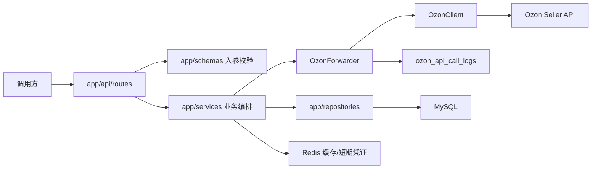

# APP 接口逻辑整理

本文整理 `app/` 内所有本地接口的职责、转发的 Ozon Seller API、请求参数、响应参数和落库行为。

当前约定：

- 本地业务接口统一挂在 `/api` 下。
- 需要 Ozon 凭证的接口都从请求头读取 `Client-Id` 和 `Api-Key`。
- 路由层位于 `app/api/routes/`，只做 HTTP 入参、响应模型和依赖注入。
- 业务编排位于 `app/services/`。
- Ozon endpoint 常量位于 `app/clients/ozon_endpoints.py`。
- Ozon 请求统一通过 `OzonForwarder`，会记录调用日志到 `ozon_api_call_logs`。类目缓存命中时不会再次请求 Ozon，也不会新增 Ozon 调用日志。

## 通用请求头

除健康检查外，所有 `/api/ozon/**` 接口都需要：

| Header | 必填 | 说明 |
| --- | --- | --- |
| `Client-Id` | 是 | Ozon Seller Client-Id，同时作为本地数据隔离字段 `client_id` |
| `Api-Key` | 是 | Ozon Seller Api-Key。本地 MySQL 不保存明文，只保存 SHA-256 指纹或 Redis 短期凭证引用 |
| `Content-Type` | POST JSON 请求需要 | 固定为 `application/json` |
| `X-Request-Id` | 否 | 目前通用转发接口会写入 Ozon 调用日志；部分整合流程会自己生成 `request_id` |

## 分层职责

| 层级 | 目录/文件 | 责任 |
| --- | --- | --- |
| HTTP 路由 | `app/api/routes/` | 定义本地接口路径、请求/响应模型、Swagger 文案，调用服务层 |
| 路由聚合 | `app/api/router.py` | 将业务路由挂到 `/api` 前缀下 |
| 兼容路由 | `app/routes/ozon.py` | 保留旧导入路径，不再保存业务逻辑 |
| 服务编排 | `app/services/` | 编排 Ozon 调用、缓存、任务落库、状态确认 |
| Ozon 转发 | `app/services/ozon_forwarder.py` | 统一调用 Ozon、记录 API 调用日志 |
| Ozon 客户端 | `app/clients/ozon.py` | 发起 HTTP 请求、解析响应、转换错误 |
| Ozon 路径常量 | `app/clients/ozon_endpoints.py` | 集中维护 Ozon Seller API endpoint |
| 数据访问 | `app/repositories/` | 封装 MySQL 读写 |
| 请求模型 | `app/schemas/` | Pydantic 请求/响应结构和 Swagger 字段说明 |

## 请求流

## 接口总览

| 本地接口 | 能做什么 | 转发/调用的 Ozon API | 业务落库 |
| --- | --- | --- | --- |
| `POST /api/ozon/proxy/{endpoint}` | 通用 Ozon API 转发 | 调用方路径参数指定 | 否，仅 API 调用日志 |
| `POST /api/ozon/categories/tree` | 查询 Ozon 类目树 | `/v1/description-category/tree` | Redis 缓存；MySQL 仅 API 调用日志 |
| `POST /api/ozon/categories/attributes` | 查询类目属性 | `/v1/description-category/attribute` | Redis 缓存；MySQL 仅 API 调用日志 |
| `POST /api/ozon/categories/attribute-values` | 查询属性字典值 | `/v1/description-category/attribute/values` | Redis 缓存；MySQL 仅 API 调用日志 |
| `POST /api/ozon/categories/attribute-values/search` | 搜索属性字典值 | `/v1/description-category/attribute/values/search` | Redis 缓存；MySQL 仅 API 调用日志 |
| `POST /api/ozon/product/info/limit` | 查询商品创建/更新额度 | `/v4/product/info/limit` | 否，仅 API 调用日志 |
| `POST /api/ozon/products/import` | 创建或更新商品 | `/v4/product/info/limit`、`/v3/product/import` | 是，任务和商品快照 |
| `GET /api/ozon/products/import-tasks/{task_id}` | 查询商品导入任务结果 | `/v1/product/import/info` | 是，任务结果、任务明细、商品状态 |
| `POST /api/ozon/products/attributes/update` | 仅更新商品属性 | `/v1/product/attributes/update` | 是，异步任务 |
| `POST /api/ozon/products/pictures/import` | 按 `offer_id` 替换商品图片列表 | `/v3/product/info/list`、`/v1/product/pictures/import` | 否，仅 API 调用日志；可能回写本地 product_id 映射 |
| `POST /api/ozon/products/info/list` | 按 `offer_id` 查询商品基础信息 | `/v3/product/info/list` | 否，仅 API 调用日志 |
| `POST /api/ozon/products/info/attributes` | 按 `offer_id` 查询商品已填写属性 | `/v3/products/info/attributes` | 否，仅 API 调用日志 |
| `POST /api/ozon/products/archive` | 按 `offer_id` 归档商品 | `/v3/product/info/list`、`/v1/product/archive`、`/v3/product/info/list` | 是，归档批次、明细、商品状态、历史 |
| `POST /api/ozon/products/unarchive` | 按 `offer_id` 从归档还原商品 | `/v3/product/info/list`、`/v1/product/unarchive`、`/v3/product/info/list` | 是，还原批次、明细、商品状态、历史 |
| `POST /api/ozon/warehouses/list` | 查询仓库列表 | `/v2/warehouse/list` | 是，仓库缓存 |
| `POST /api/ozon/products/stocks` | 按 `offer_id` 转发设置商品可售库存 | `/v2/products/stocks` | 否，仅 API 调用日志 |
| `POST /api/ozon/products/stocks/update` | 按 `offer_id` 设置商品可售库存 | `/v2/warehouse/list`、`/v3/product/info/list`、`/v2/products/stocks`、可选 `/v4/product/info/stocks` | 是，库存批次、明细、仓库、商品库存 |
| `GET /api/health` | API 健康检查 | 无 | 否 |
| `GET /health` | 根路径健康检查 | 无 | 否 |

## 1. 通用 Ozon 转发

### `POST /api/ozon/proxy/{endpoint}`

用于把任意 JSON 请求体原样转发到指定 Ozon endpoint。适合临时调用尚未封装成本地业务接口的 Ozon API。

| 项 | 说明 |
| --- | --- |
| 路由文件 | `app/api/routes/proxy.py` |
| 服务 | `OzonForwarder.post` |
| Ozon API | 由路径参数 `endpoint` 决定，例如 `v1/description-category/tree` |
| 能做什么 | 调用任意 Ozon POST 接口，自动补充 `Client-Id`、`Api-Key` 请求头，并记录调用日志 |

请求参数：

| 参数 | 位置 | 类型 | 必填 | 说明 |
| --- | --- | --- | --- | --- |
| `endpoint` | path | string | 是 | Ozon API path，不要带域名，例如 `v1/product/archive` |
| body | JSON body | object | 否 | 原样发送给 Ozon；空 body 会按 `{}` 发送 |

响应参数：

| 字段 | 类型 | 说明 |
| --- | --- | --- |
| 任意字段 | object | Ozon 原始响应 |

落库：

| 表/存储 | 写入内容 |
| --- | --- |
| `ozon_api_call_logs` | `client_id`、`api_key_fingerprint`、`request_id`、`endpoint`、`http_status`、`success`、`duration_ms`、`request_payload`、`response_payload`、`error_message` |

## 2. 类目与属性接口

### `POST /api/ozon/categories/tree`

查询 Ozon 类目树，用来获取创建商品所需的 `description_category_id` 和 `type_id`。

| 项 | 说明 |
| --- | --- |
| 路由文件 | `app/api/routes/categories.py` |
| 服务 | `CategoryService.tree` |
| Ozon API | `POST /v1/description-category/tree` |
| 能做什么 | 获取类目、子类目、商品类型树；创建商品前通常先调用 |

请求参数：

| 字段 | 类型 | 必填 | 默认值 | 说明 |
| --- | --- | --- | --- | --- |
| `language` | string | 否 | `DEFAULT` | 响应语言。`DEFAULT` 默认使用俄语；可选 `RU`、`EN`、`TR`、`ZH_HANS` |

响应参数：

| 字段 | 类型 | 说明 |
| --- | --- | --- |
| 任意字段 | object | Ozon `/v1/description-category/tree` 原始响应 |

落库/缓存：

| 表/存储 | 写入内容 |
| --- | --- |
| Redis | 缓存 key：`ozon:category-cache:{client_id}:tree:{payload_hash}`，TTL 来自 `OZON_CATEGORY_TREE_TTL_SECONDS` |
| `ozon_api_call_logs` | 缓存未命中且实际请求 Ozon 时记录调用日志 |

### `POST /api/ozon/categories/attributes`

查询指定类目和商品类型下的属性列表。

| 项 | 说明 |
| --- | --- |
| 服务 | `CategoryService.attributes` |
| Ozon API | `POST /v1/description-category/attribute` |
| 能做什么 | 获取属性 ID、是否必填、是否字典属性、是否多值等信息，用于组装商品 `attributes` |

请求参数：

| 字段 | 类型 | 必填 | 默认值 | 说明 |
| --- | --- | --- | --- | --- |
| `description_category_id` | integer | 是 | 无 | 类目 ID，来自类目树 |
| `type_id` | integer | 是 | 无 | 商品类型 ID，来自类目树 |
| `language` | string | 否 | `DEFAULT` | 响应语言。`DEFAULT` 默认使用俄语；可选 `RU`、`EN`、`TR`、`ZH_HANS` |

响应参数：

| 字段 | 类型 | 说明 |
| --- | --- | --- |
| 任意字段 | object | Ozon `/v1/description-category/attribute` 原始响应 |

落库/缓存：

| 表/存储 | 写入内容 |
| --- | --- |
| Redis | 缓存 key：`ozon:category-cache:{client_id}:attributes:{payload_hash}`，TTL 来自 `OZON_CATEGORY_ATTRIBUTES_TTL_SECONDS` |
| `ozon_api_call_logs` | 缓存未命中且实际请求 Ozon 时记录调用日志 |

### `POST /api/ozon/categories/attribute-values`

查询某个字典属性的可选值。

| 项 | 说明 |
| --- | --- |
| 服务 | `CategoryService.values` |
| Ozon API | `POST /v1/description-category/attribute/values` |
| 能做什么 | 获取 `dictionary_value_id`，用于商品属性值提交 |

请求参数：

| 字段 | 类型 | 必填 | 默认值 | 说明 |
| --- | --- | --- | --- | --- |
| `description_category_id` | integer | 是 | 无 | 类目 ID |
| `type_id` | integer | 是 | 无 | 商品类型 ID |
| `attribute_id` | integer | 是 | 无 | 属性 ID |
| `limit` | integer | 否 | `2000` | 返回数量，1 到 2000 |
| `last_value_id` | integer | 否 | `0` | 分页起点；响应 `has_next=true` 时传上次最后一个值 ID |
| `language` | string | 否 | `DEFAULT` | 响应语言。`DEFAULT` 默认使用俄语；可选 `RU`、`EN`、`TR`、`ZH_HANS` |

响应参数：

| 字段 | 类型 | 说明 |
| --- | --- | --- |
| 任意字段 | object | Ozon `/v1/description-category/attribute/values` 原始响应 |

落库/缓存：

| 表/存储 | 写入内容 |
| --- | --- |
| Redis | 缓存 key：`ozon:category-cache:{client_id}:values:{payload_hash}`，TTL 来自 `OZON_ATTRIBUTE_VALUES_TTL_SECONDS` |
| `ozon_api_call_logs` | 缓存未命中且实际请求 Ozon 时记录调用日志 |

### `POST /api/ozon/categories/attribute-values/search`

按关键词搜索字典属性值。

| 项 | 说明 |
| --- | --- |
| 服务 | `CategoryService.search_values` |
| Ozon API | `POST /v1/description-category/attribute/values/search` |
| 能做什么 | 字典值很多时按关键字搜索，减少翻页 |

请求参数：

| 字段 | 类型 | 必填 | 默认值 | 说明 |
| --- | --- | --- | --- | --- |
| `description_category_id` | integer | 是 | 无 | 类目 ID |
| `type_id` | integer | 是 | 无 | 商品类型 ID |
| `attribute_id` | integer | 是 | 无 | 属性 ID |
| `value` | string | 是 | 无 | 搜索关键词，至少 2 个字符 |
| `limit` | integer | 否 | `100` | 返回数量，1 到 100 |

响应参数：

| 字段 | 类型 | 说明 |
| --- | --- | --- |
| 任意字段 | object | Ozon `/v1/description-category/attribute/values/search` 原始响应 |

落库/缓存：

| 表/存储 | 写入内容 |
| --- | --- |
| Redis | 缓存 key：`ozon:category-cache:{client_id}:values-search:{payload_hash}`，TTL 来自 `OZON_ATTRIBUTE_VALUES_TTL_SECONDS` |
| `ozon_api_call_logs` | 缓存未命中且实际请求 Ozon 时记录调用日志 |

## 3. 商品创建、更新、查询接口

### `POST /api/ozon/product/info/limit`

查询商品创建或更新额度。

| 项 | 说明 |
| --- | --- |
| 服务 | `ProductQueryService.info_limit` |
| Ozon API | `POST /v4/product/info/limit` |
| 能做什么 | 创建/更新商品前查看额度，避免触发 Ozon 限制 |

请求参数：无，服务发送 `{}` 给 Ozon。

响应参数：

| 字段 | 类型 | 说明 |
| --- | --- | --- |
| 任意字段 | object | Ozon `/v4/product/info/limit` 原始响应 |

落库：不写业务表，仅写 `ozon_api_call_logs`。

### `POST /api/ozon/products/import`

创建或更新商品，属于本地整合流程。

| 项 | 说明 |
| --- | --- |
| 路由文件 | `app/api/routes/products.py` |
| 服务 | `ProductImportService.import_products` |
| Ozon API | 先调用 `POST /v4/product/info/limit`，再调用 `POST /v3/product/import` |
| 能做什么 | 批量创建商品、更新商品基础信息/价格/图片/属性，并保存 Ozon 异步任务 |

请求参数：

| 字段 | 类型 | 必填 | 说明 |
| --- | --- | --- | --- |
| `items` | array | 是 | 商品列表，最多 100 个 |
| `items[].offer_id` | string | 是 | 卖家系统商品货号，同一 `Client-Id` 下应唯一 |
| `items[].name` | string | 否 | 商品名称，最多 500 字符 |
| `items[].description_category_id` | integer | 否 | Ozon 类目 ID |
| `items[].type_id` | integer | 否 | Ozon 商品类型 ID |
| `items[].barcode` | string | 否 | 商品条码 |
| `items[].currency_code` | string | 否 | 币种，例如 `RUB`、`CNY`、`USD` |
| `items[].price` | string | 否 | 当前售价，字符串格式 |
| `items[].old_price` | string | 否 | 划线价 |
| `items[].vat` | string | 否 | 增值税税率 |
| `items[].depth` | integer | 否 | 包装深度/厚度 |
| `items[].width` | integer | 否 | 包装宽度 |
| `items[].height` | integer | 否 | 包装高度 |
| `items[].dimension_unit` | string | 否 | 尺寸单位，如 `mm`、`cm`、`in` |
| `items[].weight` | integer | 否 | 含包装重量 |
| `items[].weight_unit` | string | 否 | 重量单位，如 `g`、`kg`、`lb` |
| `items[].images` | array[string] | 否 | 普通图片 URL |
| `items[].primary_image` | string | 否 | 主图 URL |
| `items[].images360` | array[string] | 否 | 360 图片 URL |
| `items[].color_image` | string | 否 | 营销色彩图 URL |
| `items[].pdf_list` | array[object] | 否 | PDF 文件列表 |
| `items[].attributes` | array[object] | 否 | 商品普通属性 |
| `items[].attributes[].complex_id` | integer | 否 | 复合属性 ID，普通属性传 `0` |
| `items[].attributes[].id` | integer | 是 | Ozon 属性 ID |
| `items[].attributes[].values` | array[object] | 否 | 属性值数组 |
| `items[].attributes[].values[].dictionary_value_id` | integer | 否 | 字典值 ID，非字典属性通常为 `0` |
| `items[].attributes[].values[].value` | string/number/bool/null | 否 | 属性值 |
| `items[].complex_attributes` | array[object] | 否 | 复合/嵌套属性 |

说明：商品创建/更新对外只使用 `offer_id` 作为商品业务标识，`items[]` 中禁止传 `product_id`、`sku`。

响应参数：

| 字段 | 类型 | 说明 |
| --- | --- | --- |
| `limit` | object | `/v4/product/info/limit` 原始响应 |
| `import_result` | object | `/v3/product/import` 原始响应 |
| `task_id` | integer/null | Ozon 异步任务 ID |
| `credential_ref_saved` | boolean | 是否已把本次凭证短期保存到 Redis，供后续轮询使用 |

落库/缓存：

| 表/存储 | 写入内容 |
| --- | --- |
| `ozon_import_tasks` | 当 Ozon 返回 `task_id` 时写入 `client_id`、`task_id`、`action_type='product_import'`、`status='pending'`、`credential_ref`、`request_payload`、`response_payload` |
| `ozon_products` | 按 `offer_id` upsert 商品快照：`client_id`、`offer_id`、`local_sku`、`name`、`description_category_id`、`type_id`、`currency_code`、`price`、`old_price`、`vat`、`barcode`、`sync_status='pending'`、`last_task_id`、`last_request_payload` |
| Redis | 当存在 `task_id` 时短期保存 Ozon 凭证，MySQL 只保存 `credential_ref` |
| `ozon_api_call_logs` | 两次 Ozon 调用各写一条日志 |

### `GET /api/ozon/products/import-tasks/{task_id}`

查询商品创建/更新异步任务状态，并把结果回写本地。

| 项 | 说明 |
| --- | --- |
| 路由文件 | `app/api/routes/tasks.py` |
| 服务 | `ProductImportService.poll_import_task` |
| Ozon API | `POST /v1/product/import/info` |
| 能做什么 | 查询商品导入结果，得到每个 `offer_id` 的状态、`product_id`、错误信息，并更新本地任务和商品状态 |

请求参数：

| 参数 | 位置 | 类型 | 必填 | 说明 |
| --- | --- | --- | --- | --- |
| `task_id` | path | integer | 是 | Ozon 异步任务 ID |

响应参数：

| 字段 | 类型 | 说明 |
| --- | --- | --- |
| `task_id` | integer | 查询的任务 ID |
| `status` | string | 本地归纳后的任务状态：`pending`、`imported`、`failed`、`skipped`、`partial` |
| `data` | object | Ozon `/v1/product/import/info` 原始响应 |

落库：

| 表/存储 | 写入内容 |
| --- | --- |
| `ozon_import_tasks` | 更新 `status`、`result_payload`、`error_payload`、`last_polled_at`；终态时更新 `finished_at` |
| `ozon_import_task_items` | 按 `offer_id` upsert `client_id`、`task_id`、`offer_id`、`product_id`、`status`、`errors`、`raw_item` |
| `ozon_products` | 按 `client_id + offer_id` 更新 `product_id`、`sync_status`、`last_error`、`last_response_payload` |
| `ozon_api_call_logs` | 记录 `/v1/product/import/info` 调用日志 |

### `POST /api/ozon/products/attributes/update`

仅更新商品属性，适合不想整体重新导入商品时使用。

| 项 | 说明 |
| --- | --- |
| 服务 | `ProductImportService.update_attributes` |
| Ozon API | `POST /v1/product/attributes/update` |
| 能做什么 | 批量提交商品属性更新，返回异步任务 ID |

请求参数：

| 字段 | 类型 | 必填 | 说明 |
| --- | --- | --- | --- |
| `items` | array[object] | 是 | 待更新属性的商品数组；每项通常包含 `offer_id` 和 `attributes` |

说明：`items[].offer_id` 必填，`items[]` 中禁止传 `product_id`、`sku`。

响应参数：

| 字段 | 类型 | 说明 |
| --- | --- | --- |
| `task_id` | integer/null | Ozon 异步任务 ID |
| `data` | object | Ozon `/v1/product/attributes/update` 原始响应 |

落库/缓存：

| 表/存储 | 写入内容 |
| --- | --- |
| `ozon_import_tasks` | 当返回 `task_id` 时写入 `action_type='attribute_update'`、`status='pending'`、`credential_ref`、`request_payload`、`response_payload` |
| Redis | 当存在 `task_id` 时短期保存 Ozon 凭证 |
| `ozon_api_call_logs` | 记录 Ozon 调用日志 |

说明：该接口本身不直接更新 `ozon_products`。后续调用 `GET /api/ozon/products/import-tasks/{task_id}` 后，才会根据任务结果回写商品状态。

### `POST /api/ozon/products/pictures/import`

按 `offer_id` 上传或更新商品图片。服务内部会先用 `client_id + offer_id` 查本地商品映射；如果本地没有 `product_id`，会调用 `/v3/product/info/list` 按 `offer_id` 查询并解析 `product_id`，再调用 Ozon 图片接口。注意该 Ozon 接口会用本次传入的图片列表替换商品最终图片列表，不是追加。

| 项 | 说明 |
| --- | --- |
| 服务 | `ProductQueryService.pictures_import` |
| Ozon API | 可能先调用 `POST /v3/product/info/list`，再调用 `POST /v1/product/pictures/import` |
| 能做什么 | 对外按 `offer_id` 替换商品普通图片、360 图片和营销色彩图 |

请求参数：

| 字段 | 类型 | 必填 | 说明 |
| --- | --- | --- | --- |
| `offer_id` | string | 是 | 卖家系统商品货号 |
| `images` | array[string] | 否 | 最终保留的普通图片 URL 列表 |
| `images360` | array[string] | 否 | 最终保留的 360 图片 URL 列表 |
| `color_image` | string/null | 否 | 营销色彩图 URL |

响应参数：

| 字段 | 类型 | 说明 |
| --- | --- | --- |
| 任意字段 | object | Ozon `/v1/product/pictures/import` 原始响应 |

落库：

| 表 | 写入内容 |
| --- | --- |
| `ozon_products` | 如果本地缺少 `product_id` 且通过 Ozon 查询到了商品，会按 `client_id + offer_id` 更新 `product_id`、`sku`、`last_response_payload` |
| `ozon_api_call_logs` | 记录商品查询和图片更新调用日志 |

### `POST /api/ozon/products/info/list`

按 `offer_id` 查询商品基础信息。

| 项 | 说明 |
| --- | --- |
| 服务 | `ProductQueryService.info_list` |
| Ozon API | `POST /v3/product/info/list` |
| 能做什么 | 查询商品基础信息、状态、图片、归档状态、SKU 等；也常作为归档/库存流程的前置查询。对外请求参数只支持 `offer_id` |

请求参数：

| 字段 | 类型 | 必填 | 说明 |
| --- | --- | --- | --- |
| `offer_id` | array[string] | 是 | 按卖家货号查询 |

说明：`offer_id` 总数最多 1000。请求体禁止传 `product_id`、`sku`。

响应参数：

| 字段 | 类型 | 说明 |
| --- | --- | --- |
| 任意字段 | object | Ozon `/v3/product/info/list` 原始响应 |

落库：不写业务表，仅写 `ozon_api_call_logs`。

### `POST /api/ozon/products/info/attributes`

查询商品已经填写的属性。

| 项 | 说明 |
| --- | --- |
| 服务 | `ProductQueryService.info_attributes` |
| Ozon API | `POST /v3/products/info/attributes` |
| 能做什么 | 更新商品前查看已有属性、尺寸、重量、图片等信息 |

请求参数：

| 字段 | 类型 | 必填 | 默认值 | 说明 |
| --- | --- | --- | --- | --- |
| `offer_id` | string | 是 | - | 卖家系统商品货号；服务内部转为 Ozon `filter.offer_id` |

响应参数：

| 字段 | 类型 | 说明 |
| --- | --- | --- |
| 任意字段 | object | Ozon `/v3/products/info/attributes` 原始响应 |

落库：不写业务表，仅写 `ozon_api_call_logs`。

## 4. 商品归档与还原接口

### `POST /api/ozon/products/archive`

本地归档整合接口。调用方只传 `offer_id`，服务会先查商品信息并转换成 Ozon 归档接口需要的 `product_id`。

| 项 | 说明 |
| --- | --- |
| 路由文件 | `app/api/routes/archive.py` |
| 服务 | `ProductArchiveService.archive_products` |
| Ozon API | `POST /v3/product/info/list`、`POST /v1/product/archive`、可选 `POST /v3/product/info/list` |
| 能做什么 | 批量归档商品；自动过滤已归档商品；每 100 个 `product_id` 分批调用 Ozon；可在归档后确认 `is_archived=true` |

请求参数：

| 字段 | 类型 | 必填 | 默认值 | 说明 |
| --- | --- | --- | --- | --- |
| `offer_id` | array[string] | 是 | `[]` | 卖家系统商品货号 |
| `confirm` | boolean | 否 | `true` | 是否归档后再次查询确认 |

校验规则：`offer_id` 至少传一个，总数不能超过 1000。请求体禁止传 `product_id`、`sku`。

响应参数：

| 字段 | 类型 | 说明 |
| --- | --- | --- |
| `request_id` | string | 本地请求 ID |
| `archive_task_id` | integer | 本地归档批次 ID，对应 `ozon_archive_tasks.id` |
| `status` | string | 批次状态：`success`、`partial`、`failed`、`skipped` |
| `total_count` | integer | 本次解析出的商品总数 |
| `success_count` | integer | 成功数量 |
| `failed_count` | integer | 失败数量 |
| `skipped_count` | integer | 跳过数量 |
| `precheck` | object | 归档前 `/v3/product/info/list` 原始响应 |
| `archive_result` | object | 归档接口响应；批量超过 100 时包含 `chunks` |
| `confirm` | object | 归档后确认查询响应 |
| `items` | array[object] | 单商品处理结果 |
| `items[].offer_id` | string/null | 卖家货号 |
| `items[].product_id` | integer/null | Ozon 商品 ID，内部解析结果 |
| `items[].sku` | integer/null | Ozon SKU，内部解析结果 |
| `items[].before_is_archived` | boolean/null | 归档前是否手动归档 |
| `items[].before_is_autoarchived` | boolean/null | 归档前是否自动归档 |
| `items[].after_is_archived` | boolean/null | 归档后是否手动归档 |
| `items[].after_is_autoarchived` | boolean/null | 归档后是否自动归档 |
| `items[].status` | string | `success`、`failed`、`skipped`、`not_found`、`already_archived` |
| `items[].skip_reason` | string/null | 跳过原因 |
| `items[].error_message` | string/null | 失败原因 |

落库：

| 表 | 写入内容 |
| --- | --- |
| `ozon_archive_tasks` | 创建批次：`client_id`、`request_id`、`action_type='archive'`、`status='pending'`、`input_identifiers`、`total_count`；完成后更新 `status`、`precheck_payload`、`request_payload`、`response_payload`、`confirm_payload`、`error_payload`、数量统计、`finished_at` |
| `ozon_archive_task_items` | 每个商品一条明细：标识类型和值、`offer_id`、`product_id`、`sku`、操作前后归档状态、`status`、`skip_reason`、`error_message`、`precheck_payload`、`operation_response_payload`、`confirm_payload` |
| `ozon_products` | 有 `offer_id` 时更新商品归档状态：`product_id`、`sku`、`sync_status`、`is_archived`、`is_autoarchived`、`archive_status`、`archived_at`、`archive_checked_at`、`last_archive_request_id`、`last_archive_error`、`last_response_payload` |
| `ozon_product_archive_history` | 有 `offer_id` 时写状态变更历史：`action_type='archive'`、来源、操作前后归档状态和 payload |
| `ozon_api_call_logs` | 每次 Ozon 查询、归档、确认调用都会记录 |

### `POST /api/ozon/products/unarchive`

本地还原整合接口。调用方只传 `offer_id`。与归档流程相反，服务会过滤未归档商品，只对已归档或自动归档的商品调用还原。

| 项 | 说明 |
| --- | --- |
| 服务 | `ProductUnarchiveService.unarchive_products` |
| Ozon API | `POST /v3/product/info/list`、`POST /v1/product/unarchive`、可选 `POST /v3/product/info/list` |
| 能做什么 | 批量从归档还原商品；自动过滤未归档商品；每 100 个 `product_id` 分批调用 Ozon；可在还原后确认 `is_archived=false`、`is_autoarchived=false` |

请求参数：

| 字段 | 类型 | 必填 | 默认值 | 说明 |
| --- | --- | --- | --- | --- |
| `offer_id` | array[string] | 是 | `[]` | 卖家系统商品货号 |
| `confirm` | boolean | 否 | `true` | 是否还原后再次查询确认 |

校验规则：`offer_id` 至少传一个，总数不能超过 1000。请求体禁止传 `product_id`、`sku`。

响应参数：

| 字段 | 类型 | 说明 |
| --- | --- | --- |
| `request_id` | string | 本地请求 ID |
| `archive_task_id` | integer | 本地归档工作流批次 ID，对应 `ozon_archive_tasks.id` |
| `status` | string | 批次状态：`success`、`partial`、`failed`、`skipped` |
| `total_count` | integer | 本次解析出的商品总数 |
| `success_count` | integer | 成功数量 |
| `failed_count` | integer | 失败数量 |
| `skipped_count` | integer | 跳过数量 |
| `precheck` | object | 还原前 `/v3/product/info/list` 原始响应 |
| `unarchive_result` | object | 还原接口响应；批量超过 100 时包含 `chunks` |
| `confirm` | object | 还原后确认查询响应 |
| `items` | array[object] | 单商品处理结果 |
| `items[].status` | string | `success`、`failed`、`skipped`、`not_found`、`not_archived` |
| `items[].offer_id/product_id/sku` | string/integer/null | 商品标识，其中 `product_id`、`sku` 为内部解析结果 |
| `items[].before_is_archived` | boolean/null | 还原前是否手动归档 |
| `items[].before_is_autoarchived` | boolean/null | 还原前是否自动归档 |
| `items[].after_is_archived` | boolean/null | 还原后是否手动归档 |
| `items[].after_is_autoarchived` | boolean/null | 还原后是否自动归档 |
| `items[].skip_reason` | string/null | 跳过原因 |
| `items[].error_message` | string/null | 失败原因 |

落库：

| 表 | 写入内容 |
| --- | --- |
| `ozon_archive_tasks` | 创建批次时 `action_type='unarchive'`；完成后写入 precheck、request、response、confirm、error、数量统计 |
| `ozon_archive_task_items` | 每个商品一条还原明细，字段同归档流程 |
| `ozon_products` | 有 `offer_id` 时更新为当前归档状态；还原成功时 `archive_status='active'`、`is_archived=0`、`is_autoarchived=0` |
| `ozon_product_archive_history` | 有 `offer_id` 时写状态变更历史：`action_type='unarchive'`、`source='unarchive_workflow'` |
| `ozon_api_call_logs` | 每次 Ozon 查询、还原、确认调用都会记录 |

## 5. 库存接口

### `POST /api/ozon/warehouses/list`

查询当前账号下的仓库列表。该接口封装 Ozon 新版仓库列表接口 `/v2/warehouse/list`，用于获取库存更新所需的 `warehouse_id`。

| 项 | 说明 |
| --- | --- |
| 路由文件 | `app/api/routes/stocks.py` |
| 服务 | `ProductStockService.list_warehouses` |
| Ozon API | `POST /v2/warehouse/list` |
| 能做什么 | 查询仓库 ID、仓库名称、状态、rFBS/KGT 标记、地址和工作时间等信息，并缓存到本地 |

请求参数：

| 字段 | 类型 | 必填 | 默认值 | 说明 |
| --- | --- | --- | --- | --- |
| `cursor` | string | 否 | `""` | 分页游标，首次请求留空 |
| `limit` | integer | 否 | `200` | 返回数量，1 到 200 |
| `warehouse_ids` | array[integer/string] | 否 | `[]` | 按仓库 ID 过滤，最多 200 个 |

响应参数：

| 字段 | 类型 | 说明 |
| --- | --- | --- |
| `cursor` | string | 后续数据的选择标志 |
| `warehouses` | array[object] | 仓库列表，Ozon 原始结构 |
| `has_next` | boolean | 是否还有下一页 |

落库：

| 表 | 写入内容 |
| --- | --- |
| `ozon_warehouses` | 按 `client_id + warehouse_id` upsert 仓库：`warehouse_id`、`name`、`status`、`is_rfbs`、`is_kgt`、`raw_payload` |
| `ozon_api_call_logs` | 记录 `/v2/warehouse/list` 调用日志 |

### `POST /api/ozon/products/stocks`

轻量库存更新直转接口。调用方按单个商品传 `offer_id`，服务内部组装为 Ozon `/v2/products/stocks` 的 `stocks[].offer_id` 请求体。

| 项 | 说明 |
| --- | --- |
| 路由文件 | `app/api/routes/stocks.py` |
| 服务 | `ProductStockService.products_stocks` |
| Ozon API | `POST /v2/products/stocks` |
| 能做什么 | 按 `offer_id`、仓库和库存数量直接转发设置商品可售库存 |

请求参数：

| 字段 | 类型 | 必填 | 默认值 | 说明 |
| --- | --- | --- | --- | --- |
| `offer_id` | string | 是 | 无 | 卖家系统商品货号；服务内部转为 `stocks[].offer_id` |
| `warehouse_id` | integer | 是 | 无 | Ozon 仓库 ID，来自 `/v2/warehouse/list` |
| `stock` | integer | 是 | 无 | 要设置的可售库存数量，不能小于 0 |

响应参数：

| 字段 | 类型 | 说明 |
| --- | --- | --- |
| 任意字段 | object | Ozon `/v2/products/stocks` 原始响应 |

落库：不写业务表，仅写 `ozon_api_call_logs`。

### `POST /api/ozon/products/stocks/update`

本地库存更新整合接口。调用方只传 `offer_id`。服务会校验仓库、查询商品 SKU、可选查询预留库存，再调用 Ozon 库存更新接口。

| 项 | 说明 |
| --- | --- |
| 路由文件 | `app/api/routes/stocks.py` |
| 服务 | `ProductStockService.update_stocks` |
| Ozon API | `POST /v2/warehouse/list`、`POST /v3/product/info/list`、`POST /v2/products/stocks`、可选 `POST /v4/product/info/stocks` |
| 能做什么 | 按 `offer_id` 设置指定仓库的可售库存，记录每个商品的更新结果 |

请求参数：

| 字段 | 类型 | 必填 | 默认值 | 说明 |
| --- | --- | --- | --- | --- |
| `stocks` | array[object] | 是 | 无 | 库存更新列表，1 到 100 个 |
| `stocks[].offer_id` | string | 是 | 无 | 卖家系统商品货号 |
| `stocks[].warehouse_id` | integer | 是 | 无 | Ozon 仓库 ID，来自 `/v2/warehouse/list` |
| `stocks[].stock` | integer | 是 | 无 | 要设置的可售库存数量，不能小于 0 |
| `check_reserved` | boolean | 否 | `false` | 兼容旧参数，当前流程不再查询仓库维度预留库存 |
| `confirm` | boolean | 否 | `true` | 是否更新后通过 `/v4/product/info/stocks` 做商品级确认 |

说明：请求体禁止传 `product_id`、`sku`。服务内部会按 `offer_id` 查询 Ozon 商品信息，用于校验商品存在并记录 Ozon 标识；更新库存时直接向 `/v2/products/stocks` 提交 `offer_id + warehouse_id + stock`。

响应参数：

| 字段 | 类型 | 说明 |
| --- | --- | --- |
| `request_id` | string | 本地库存更新请求 ID |
| `stock_task_id` | integer | 本地库存更新批次 ID |
| `status` | string | 批次状态：`success`、`partial`、`failed` |
| `total_count` | integer | 请求商品数量 |
| `success_count` | integer | 成功数量 |
| `failed_count` | integer | 失败数量 |
| `warehouse_result` | object | Ozon `/v2/warehouse/list` 原始响应 |
| `product_result` | object | Ozon `/v3/product/info/list` 原始响应 |
| `reserved_result` | object | 兼容旧字段；当前流程不再查询预留库存，通常为空对象 |
| `update_result` | object | Ozon `/v2/products/stocks` 原始响应 |
| `confirm_result` | object | 商品级库存确认查询响应 |
| `items` | array[object] | 单商品库存更新结果 |
| `items[].offer_id` | string/null | 卖家货号 |
| `items[].product_id` | integer/null | Ozon 商品 ID |
| `items[].sku` | integer/null | Ozon SKU |
| `items[].warehouse_id` | integer | 仓库 ID |
| `items[].requested_stock` | integer | 本次请求设置的可售库存 |
| `items[].present` | integer/null | 当前流程不再查询仓库维度库存，通常为 `null` |
| `items[].reserved` | integer/null | 当前流程不再查询仓库维度预留，通常为 `null` |
| `items[].updated` | boolean | Ozon 是否返回更新成功 |
| `items[].status` | string | `success` 或 `failed` |
| `items[].error_message` | string/null | 失败原因 |

落库：

| 表 | 写入内容 |
| --- | --- |
| `ozon_stock_update_tasks` | 创建批次：`client_id`、`request_id`、`status='pending'`、`request_payload`、`total_count`；完成后更新 `status`、`warehouse_payload`、`product_payload`、`reserved_payload`、`response_payload`、`confirm_payload`、`error_payload`、成功/失败数量、`finished_at` |
| `ozon_stock_update_task_items` | 每个库存项一条明细：`offer_id`、`product_id`、`sku`、`warehouse_id`、`requested_stock`、`present`、`reserved`、`updated`、`status`、`error_message`、各阶段 payload |
| `ozon_warehouses` | upsert 仓库：`warehouse_id`、`name`、`status`、`is_rfbs`、`is_kgt`、`raw_payload` |
| `ozon_product_stocks` | upsert 商品仓库库存：`offer_id`、`product_id`、`sku`、`warehouse_id`、`stock`、`present`、`reserved`、`last_stock_task_id`、`last_error`、`last_response_payload` |
| `ozon_api_call_logs` | 仓库、商品、预留库存、更新、确认等每次 Ozon 调用都会记录 |

## 6. 健康检查

### `GET /api/health`

API 前缀下的健康检查。

响应参数：

| 字段 | 类型 | 说明 |
| --- | --- | --- |
| `status` | string | 固定为 `ok` |
| `service` | string | 服务名，来自配置 `APP_NAME` |

落库：无。

### `GET /health`

根路径健康检查，响应参数同 `/api/health`。

落库：无。

## 数据表用途汇总

| 表/存储 | 用途 | 主要写入接口 |
| --- | --- | --- |
| `ozon_api_call_logs` | Ozon 调用日志 | 所有实际转发到 Ozon 的接口 |
| `ozon_import_tasks` | 商品导入/属性更新异步任务 | `/products/import`、`/products/attributes/update`、`/products/import-tasks/{task_id}` |
| `ozon_import_task_items` | 商品导入任务单品结果 | `/products/import-tasks/{task_id}` |
| `ozon_products` | 商品本地快照、同步状态、归档状态 | `/products/import`、`/products/import-tasks/{task_id}`、`/products/archive`、`/products/unarchive` |
| `ozon_archive_tasks` | 归档/还原批次 | `/products/archive`、`/products/unarchive` |
| `ozon_archive_task_items` | 归档/还原单品明细 | `/products/archive`、`/products/unarchive` |
| `ozon_product_archive_history` | 商品归档状态变更历史 | `/products/archive`、`/products/unarchive` |
| `ozon_stock_update_tasks` | 库存更新批次 | `/products/stocks/update` |
| `ozon_stock_update_task_items` | 库存更新单品明细 | `/products/stocks/update` |
| `ozon_warehouses` | Ozon 仓库缓存 | `/products/stocks/update` |
| `ozon_product_stocks` | 商品仓库库存快照 | `/products/stocks/update` |
| Redis `ozon:credentials:*` | 短期保存 Ozon 凭证用于任务轮询 | `/products/import`、`/products/attributes/update` |
| Redis `ozon:category-cache:*` | 类目、属性、字典值响应缓存 | 类目与属性接口 |

## 维护规则

1. 新增 Ozon 调用时，先在 `app/clients/ozon_endpoints.py` 添加 endpoint 常量，再在服务层引用。
2. 路由层不直接写数据库、不直接调用 `OzonClient`，只负责校验、依赖注入和返回模型。
3. 需要组合多个 Ozon 接口的流程放到独立 service，例如归档、还原、库存、导入任务。
4. 需要记录 Ozon 调用日志的请求走 `OzonForwarder`，不要绕过它。
5. 旧的 `app/routes/ozon.py` 只作为兼容入口维护，不在里面新增业务逻辑。
