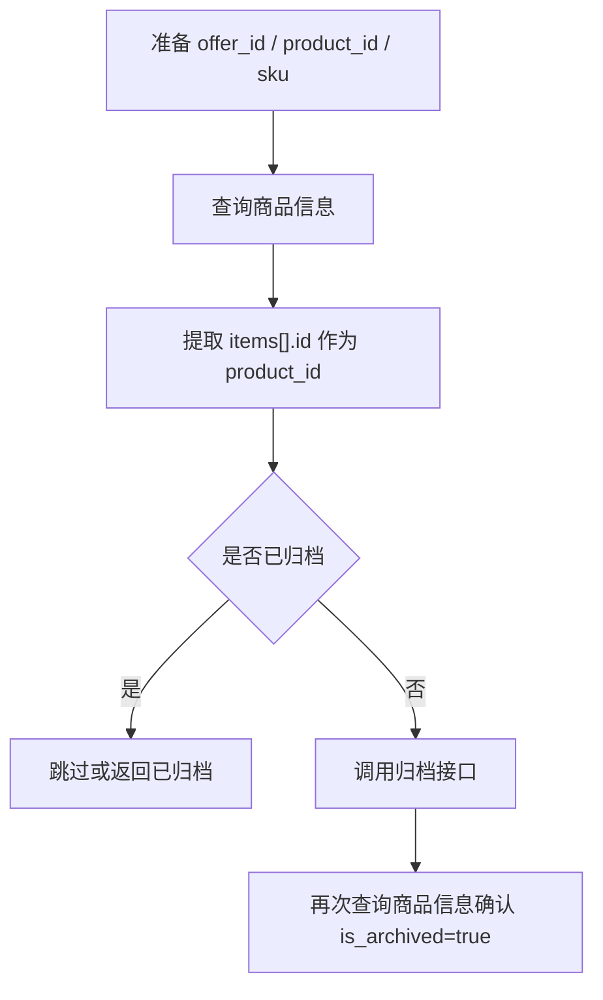

# 商品归档调用手册

本文档基于 [ProductAPI.md](../apis/ProductAPI.md) 整理，说明如果要归档商品，需要前置调用哪些接口、如何组装参数，以及如何确认归档结果。

本地服务地址示例：

```text
http://127.0.0.1:8000
```

## 结论

归档商品最终调用 Ozon 接口：

```http
POST /v1/product/archive
```

但该接口只接受 `product_id` 数组，不接受 `offer_id`。因此如果你的业务系统只有 `offer_id`、`sku` 或本地 SKU，需要先查询商品信息，把它们转换成 Ozon `product_id`。

推荐流程：



## 公共请求头

所有接口都需要：

| 请求头 | 必填 | 示例 | 说明 |
| --- | --- | --- | --- |
| `Client-Id` | 是 | `123456` | Ozon 用户识别号。 |
| `Api-Key` | 是 | `xxxxx` | Ozon API 密钥。 |
| `Content-Type` | 是 | `application/json` | JSON 请求体。 |

## 需要调用的接口

| 顺序 | 本地接口 | 背后 Ozon 接口 | 是否必调 | 作用 |
| --- | --- | --- | --- | --- |
| 1 | `POST /api/ozon/products/archive` | `POST /v3/product/info/list`、`POST /v1/product/archive`、`POST /v3/product/info/list` | 推荐 | 本地服务整合入口：自动查询商品、转换 `product_id`、过滤已归档商品、调用归档接口并确认结果。 |
| 2 | `POST /api/ozon/products/info/list` | `POST /v3/product/info/list` | 可选 | 如果调用方想自己控制流程，可先根据 `offer_id`、`product_id` 或 `sku` 查询商品，获取 Ozon `product_id` 和归档状态。 |
| 3 | `POST /api/ozon/proxy/v1/product/archive` | `POST /v1/product/archive` | 可选 | 通用转发入口。仅在调用方已经自行组装 `product_id` 时使用。 |

当前本地服务已封装专门的归档整合入口：

```http
POST /api/ozon/products/archive
```

### 整合入口请求参数

| 参数 | 类型 | 必填 | 说明 |
| --- | --- | --- | --- |
| `offer_id` | string[] | 否 | 卖家系统商品货号。服务会先查询商品信息并转换为 Ozon `product_id`。 |
| `product_id` | integer[] 或 string[] | 否 | Ozon 商品 ID。归档接口最终使用该字段。 |
| `sku` | integer[] 或 string[] | 否 | Ozon SKU。服务会先查询商品信息并转换为 Ozon `product_id`。 |
| `confirm` | boolean | 否 | 是否在归档后再次查询确认 `is_archived=true`，默认 `true`。 |

至少传 `offer_id`、`product_id`、`sku` 中的一种。

### 整合入口请求示例

```json
{
  "offer_id": ["LOCAL-SKU-001", "LOCAL-SKU-002"],
  "confirm": true
}
```

### 整合入口响应示例

```json
{
  "request_id": "8a7d5a40-9b91-4c0d-a84d-0e57cf9621dc",
  "archive_task_id": 12,
  "status": "partial",
  "total_count": 2,
  "success_count": 1,
  "failed_count": 0,
  "skipped_count": 1,
  "precheck": {},
  "archive_result": {},
  "confirm": {},
  "items": [
    {
      "offer_id": "LOCAL-SKU-001",
      "product_id": 137285792,
      "sku": 123456789,
      "before_is_archived": false,
      "before_is_autoarchived": false,
      "after_is_archived": true,
      "after_is_autoarchived": false,
      "status": "success"
    },
    {
      "offer_id": "LOCAL-SKU-002",
      "product_id": 137285793,
      "before_is_archived": true,
      "after_is_archived": true,
      "status": "already_archived",
      "skip_reason": "商品已归档"
    }
  ]
}
```

## 第一步：查询商品信息

### 请求地址

```http
POST /api/ozon/products/info/list
```

### 请求参数

| 参数 | 类型 | 必填 | 说明 |
| --- | --- | --- | --- |
| `offer_id` | string[] | 否 | 商品在卖家系统中的货号。 |
| `product_id` | string[] | 否 | Ozon 商品标识符。 |
| `sku` | string[] | 否 | Ozon SKU。 |

至少传一种标识。单次请求中 `offer_id`、`product_id`、`sku` 总数不超过 1000。

### 响应参数

| 参数 | 类型 | 说明 |
| --- | --- | --- |
| `items[]` | array | 商品信息数组。 |
| `items[].id` | integer | Ozon 商品标识符。归档接口需要把它作为 `product_id` 传入。 |
| `items[].offer_id` | string | 卖家系统商品货号。 |
| `items[].sources[].sku` | integer | Ozon SKU。 |
| `items[].is_archived` | boolean | 是否手动归档。为 `true` 时无需再次归档。 |
| `items[].is_autoarchived` | boolean | 是否自动归档。 |
| `items[].statuses` | object | 商品状态信息。 |

### 请求示例：按 offer_id 查询

```json
{
  "offer_id": ["LOCAL-SKU-001", "LOCAL-SKU-002"]
}
```

### 请求示例：按 product_id 查询

```json
{
  "product_id": ["137285792"]
}
```

### 响应示例

```json
{
  "items": [
    {
      "id": 137285792,
      "offer_id": "LOCAL-SKU-001",
      "name": "一套X3NFC保护膜",
      "is_archived": false,
      "is_autoarchived": false,
      "sources": [
        {
          "sku": 123456789,
          "source": "FBS"
        }
      ],
      "statuses": {
        "status": "created",
        "status_name": "商品创建成功"
      }
    }
  ]
}
```

### 参数组装逻辑

从响应中取：

```text
items[].id -> product_id[]
```

例如查询结果：

```json
{
  "items": [
    {
      "id": 137285792,
      "offer_id": "LOCAL-SKU-001",
      "is_archived": false
    },
    {
      "id": 137285793,
      "offer_id": "LOCAL-SKU-002",
      "is_archived": true
    }
  ]
}
```

应组装为：

```json
{
  "product_id": [137285792]
}
```

其中 `LOCAL-SKU-002` 已经归档，建议跳过。

## 第二步：调用商品归档接口

### 请求地址

```http
POST /api/ozon/proxy/v1/product/archive
```

背后 Ozon 接口：

```http
POST https://api-seller.ozon.ru/v1/product/archive
```

### 请求参数

| 参数 | 类型 | 必填 | 说明 |
| --- | --- | --- | --- |
| `product_id` | integer[] | 是 | Ozon 商品标识符数组，一次最多 100 个。来自 `POST /v3/product/info/list` 响应的 `items[].id`。 |

### 响应参数

| 参数 | 类型 | 说明 |
| --- | --- | --- |
| `result` | boolean | 请求处理结果。`true` 表示请求执行无误。 |

如果请求失败，Ozon 可能返回：

| 参数 | 类型 | 说明 |
| --- | --- | --- |
| `code` | integer | 错误代码。 |
| `message` | string | 错误描述。 |
| `details` | array | 错误补充信息。 |

### 请求示例

```json
{
  "product_id": [137285792, 137285793]
}
```

### 响应示例

```json
{
  "result": true
}
```

## 第三步：确认归档结果

归档接口返回 `result=true` 表示请求执行无误。为了确认商品状态，建议再次调用商品信息查询接口。

### 请求地址

```http
POST /api/ozon/products/info/list
```

### 请求参数

| 参数 | 类型 | 必填 | 说明 |
| --- | --- | --- | --- |
| `product_id` | string[] | 是 | 刚归档的商品 ID。 |

### 请求示例

```json
{
  "product_id": ["137285792", "137285793"]
}
```

### 响应参数

| 参数 | 类型 | 说明 |
| --- | --- | --- |
| `items[].id` | integer | 商品 ID。 |
| `items[].offer_id` | string | 商品货号。 |
| `items[].is_archived` | boolean | 如果为 `true`，表示商品已手动归档。 |
| `items[].is_autoarchived` | boolean | 如果为 `true`，表示商品被自动归档。 |

### 响应示例

```json
{
  "items": [
    {
      "id": 137285792,
      "offer_id": "LOCAL-SKU-001",
      "is_archived": true,
      "is_autoarchived": false
    }
  ]
}
```

## 完整调用示例

### 1. 按 offer_id 查询商品

```bash
curl -X POST "http://127.0.0.1:8000/api/ozon/products/info/list" ^
  -H "Client-Id: xxx" ^
  -H "Api-Key: yyy" ^
  -H "Content-Type: application/json" ^
  -d "{\"offer_id\":[\"LOCAL-SKU-001\"]}"
```

从响应中拿到：

```json
{
  "id": 137285792,
  "is_archived": false
}
```

### 2. 调用归档

```bash
curl -X POST "http://127.0.0.1:8000/api/ozon/proxy/v1/product/archive" ^
  -H "Client-Id: xxx" ^
  -H "Api-Key: yyy" ^
  -H "Content-Type: application/json" ^
  -d "{\"product_id\":[137285792]}"
```

### 3. 再次查询确认

```bash
curl -X POST "http://127.0.0.1:8000/api/ozon/products/info/list" ^
  -H "Client-Id: xxx" ^
  -H "Api-Key: yyy" ^
  -H "Content-Type: application/json" ^
  -d "{\"product_id\":[\"137285792\"]}"
```

确认响应中的：

```json
{
  "is_archived": true
}
```

## 和恢复、删除的关系

### 恢复归档商品

如果需要从档案中恢复商品，调用：

```http
POST /api/ozon/proxy/v1/product/unarchive
```

请求体：

```json
{
  "product_id": [137285792]
}
```

限制：

- 一次最多 100 个 `product_id`。
- 自动归档商品每天最多恢复 10 件。
- 手动归档商品没有该恢复限制。

### 删除没有 SKU 的归档商品

如果需要从存档删除没有 SKU 的商品，调用：

```http
POST /api/ozon/proxy/v2/products/delete
```

请求体：

```json
{
  "products": [
    {
      "offer_id": "LOCAL-SKU-001"
    }
  ]
}
```

注意：这是删除无 SKU 的归档商品，不是普通归档。不要和 `/v1/product/archive` 混用。

## 关键注意事项

- 归档接口只接受 `product_id`，不能直接传 `offer_id`。
- `product_id` 来自 `POST /v3/product/info/list` 响应中的 `items[].id`。
- 一次最多归档 100 个商品。
- 调用归档前建议过滤掉 `is_archived=true` 的商品。
- 归档后建议再次查询商品信息，确认 `is_archived=true`。
- 推荐优先调用本地整合入口 `POST /api/ozon/products/archive`；只有在需要自行控制每一步时，再使用通用转发 `POST /api/ozon/proxy/v1/product/archive`。
