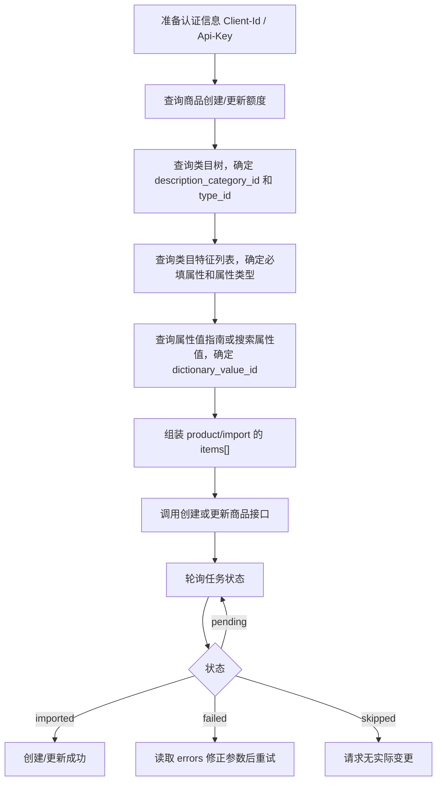

# Ozon 商品创建或更新 API 调用指南

本文档用于说明通过 API 创建或更新 Ozon 商品时，需要调用哪些前置接口，以及如何把前置接口返回的数据组装到 `POST /v3/product/import` 的请求参数中。

详细接口字段可参考：

- [CategoryAPI.md](../apis/CategoryAPI.md)
- [ProductAPI.md](../apis/ProductAPI.md)

## 总体流程



## 必须准备的公共请求头

所有接口都需要：

| Header | 必填 | 说明 |
| --- | --- | --- |
| `Client-Id` | 是 | 用户识别号 |
| `Api-Key` | 是 | API 密钥 |
| `Content-Type` | 是 | `application/json` |

## 前置接口清单

| 顺序 | 接口 | 是否必调 | 作用 | 关键输出 |
| --- | --- | --- | --- | --- |
| 1 | `POST /v4/product/info/limit` | 建议必调 | 检查当天创建/更新额度，避免触发 `item_limit_exceeded` | `daily_create`、`daily_update`、`total` |
| 2 | `POST /v1/description-category/tree` | 创建新商品必调 | 获取可创建商品的末级类目和商品类型 | `description_category_id`、`type_id` |
| 3 | `POST /v1/description-category/attribute` | 创建新商品必调 | 获取该类目/类型下的属性列表、必填属性、字典属性 | `id`、`is_required`、`dictionary_id`、`type`、`max_value_count`、`attribute_complex_id` |
| 4 | `POST /v1/description-category/attribute/values` | 字典属性必调 | 获取属性可选值列表 | `result[].id` 作为 `dictionary_value_id`，`result[].value` 作为展示值 |
| 5 | `POST /v1/description-category/attribute/values/search` | 字典值很多时调用 | 按关键词搜索字典属性值 | `result[].id`、`result[].value` |
| 6 | `POST /v3/product/import` | 必调 | 创建或更新商品 | `result.task_id` |
| 7 | `POST /v1/product/import/info` | 必调 | 查询创建/更新任务结果 | `status`、`product_id`、`errors` |

更新已有商品时，还建议先调用：

| 接口 | 作用 |
| --- | --- |
| `POST /v3/product/info/list` | 按 `offer_id`、`product_id` 或 `sku` 获取已有商品信息，例如 `description_category_id`、`type_id`、价格、图片、状态、错误 |
| `POST /v3/products/info/attributes` | 获取已有商品已填写的属性、尺寸、重量、图片等，用于合并更新请求 |

## 调用步骤

### 1. 查询创建/更新额度

接口：

```http
POST https://api-seller.ozon.ru/v4/product/info/limit
```

请求体可以为空对象：

```json
{}
```

判断逻辑：

- 新建商品前检查 `daily_create.usage < daily_create.limit`，并检查 `total.usage < total.limit`。
- 更新商品前检查 `daily_update.usage < daily_update.limit`。
- 如果额度不足，应等 `reset_at` 后再提交。

### 2. 查询类目树

接口：

```http
POST https://api-seller.ozon.ru/v1/description-category/tree
```

请求示例：

```json
{
  "language": "DEFAULT"
}
```

从响应树中选择可以创建商品的末级节点，取：

- `description_category_id`：商品类目 ID，填入 `items[].description_category_id`。
- `type_id`：商品类型 ID，填入 `items[].type_id`。
- `disabled`：如果为 `true`，不要使用该类目或类型创建商品。

### 3. 查询类目特征列表

接口：

```http
POST https://api-seller.ozon.ru/v1/description-category/attribute
```

请求示例：

```json
{
  "description_category_id": 17028922,
  "type_id": 91565,
  "language": "DEFAULT"
}
```

重点读取响应中的字段：

| 字段 | 用途 |
| --- | --- |
| `id` | 属性 ID，填入 `attributes[].id` |
| `is_required` | 是否为必填属性；创建商品时必须填 `true` 的属性 |
| `dictionary_id` | 大于 `0` 表示该属性需要从字典值中选择 |
| `type` | 属性值类型，决定 `value` 填字符串、数字或其他格式 |
| `is_collection` | 是否允许多个值 |
| `max_value_count` | 最多允许传多少个值 |
| `attribute_complex_id` | 复合属性标识；需要组装到 `complex_attributes` 或属性的 `complex_id` |

属性组装到创建接口时，基础结构如下：

```json
{
  "complex_id": 0,
  "id": 9048,
  "values": [
    {
      "dictionary_value_id": 0,
      "value": "商品属性值"
    }
  ]
}
```

### 4. 查询或搜索属性字典值

当类目特征中的 `dictionary_id > 0` 时，不建议直接手填文本，应先查可选值。

分页获取：

```http
POST https://api-seller.ozon.ru/v1/description-category/attribute/values
```

```json
{
  "description_category_id": 17028922,
  "type_id": 91565,
  "attribute_id": 85,
  "limit": 2000,
  "last_value_id": 0,
  "language": "DEFAULT"
}
```

关键词搜索：

```http
POST https://api-seller.ozon.ru/v1/description-category/attribute/values/search
```

```json
{
  "description_category_id": 17028922,
  "type_id": 91565,
  "attribute_id": 85,
  "value": "Samsung",
  "limit": 100
}
```

将返回的字典值组装为：

```json
{
  "dictionary_value_id": 5060050,
  "value": "Samsung"
}
```

如果属性没有字典值，通常传：

```json
{
  "dictionary_value_id": 0,
  "value": "自定义文本或数值"
}
```

## 创建或更新商品接口

接口：

```http
POST https://api-seller.ozon.ru/v3/product/import
```

关键规则：

- 一次请求最多提交 `100` 个商品，每个商品放在 `items[]` 的一个元素里。
- 创建商品时，需要传完整商品资料：属性、条形码、图片、尺寸、价格、币种等。
- 更新商品时，也应传完整商品资料；不要只传局部字段，否则可能导致已有信息被覆盖或更新失败。
- `description_category_id` 和 `type_id` 来自类目树。
- 必填属性来自类目特征列表中的 `is_required = true`。
- 真实体积和重量字段不要省略，也不要传 `0`：`depth`、`width`、`height`、`dimension_unit`、`weight`、`weight_unit`。
- 图片 URL 必须是公共可访问的 JPG 或 PNG 链接。
- `price`、`old_price` 使用字符串形式，例如 `"1000"`。

### items[] 核心字段

| 字段 | 来源 | 创建是否必填 | 说明 |
| --- | --- | --- | --- |
| `offer_id` | 本地系统生成 | 是 | 卖家系统商品货号，最多 50 字符；创建后用于后续更新 |
| `name` | 本地商品资料 | 是 | 商品名称，最多 500 字符 |
| `description_category_id` | `/v1/description-category/tree` | 是 | 类目 ID |
| `type_id` | `/v1/description-category/tree` | 是 | 商品类型 ID |
| `attributes` | `/v1/description-category/attribute` + 属性值接口 | 是 | 商品普通属性 |
| `complex_attributes` | 类目特征中的复合属性 | 按类目要求 | 嵌套属性，如视频、视频封面、复合规格 |
| `barcode` | 本地商品资料或生成 | 建议填 | 条形码；FBP 中国/香港销售场景需特别注意 |
| `images` | 公共图片 URL | 是 | 商品图片数组，最多 15 张 |
| `primary_image` | 公共图片 URL | 否 | 主图；不填时 `images[0]` 为主图 |
| `price` | 本地价格 | 是 | 当前售价，字符串 |
| `old_price` | 本地价格 | 否 | 划线价，字符串；无折扣时可与 `price` 一致 |
| `currency_code` | 店铺币种 | 建议填 | 例如 `RUB`、`CNY`、`USD` |
| `vat` | 税率配置 | 是 | 如 `0`、`0.05`、`0.07`、`0.1`、`0.2` |
| `depth`、`width`、`height` | 本地商品资料 | 是 | 包装尺寸 |
| `dimension_unit` | 本地商品资料 | 是 | `mm`、`cm`、`in` |
| `weight` | 本地商品资料 | 是 | 含包装重量 |
| `weight_unit` | 本地商品资料 | 是 | `g`、`kg`、`lb` |

### 创建商品请求模板

```json
{
  "items": [
    {
      "offer_id": "LOCAL-SKU-001",
      "name": "商品名称",
      "description_category_id": 17028922,
      "type_id": 91565,
      "barcode": "112772873170",
      "currency_code": "RUB",
      "price": "1000",
      "old_price": "1100",
      "vat": "0.1",
      "depth": 10,
      "width": 150,
      "height": 250,
      "dimension_unit": "mm",
      "weight": 100,
      "weight_unit": "g",
      "images": [
        "https://example.com/image-1.jpg",
        "https://example.com/image-2.jpg"
      ],
      "primary_image": "https://example.com/image-1.jpg",
      "images360": [],
      "color_image": "",
      "pdf_list": [],
      "attributes": [
        {
          "complex_id": 0,
          "id": 85,
          "values": [
            {
              "dictionary_value_id": 5060050,
              "value": "Samsung"
            }
          ]
        },
        {
          "complex_id": 0,
          "id": 9048,
          "values": [
            {
              "dictionary_value_id": 0,
              "value": "商品型号或合并卡片属性"
            }
          ]
        }
      ],
      "complex_attributes": []
    }
  ]
}
```

响应示例：

```json
{
  "result": {
    "task_id": 172549793
  }
}
```

## 查询创建或更新结果

接口：

```http
POST https://api-seller.ozon.ru/v1/product/import/info
```

请求示例：

```json
{
  "task_id": 172549793
}
```

重点判断：

| 状态 | 含义 | 处理方式 |
| --- | --- | --- |
| `pending` | 等待处理 | 延迟后继续查询 |
| `imported` | 创建或更新成功 | 记录 `product_id` 和 `offer_id` |
| `failed` | 创建或更新失败 | 读取 `errors`，按字段或属性修正后重新提交 |
| `skipped` | 未更新 | 请求没有实际变化，通常不需要重试 |

## 更新商品的推荐方式

### 全量更新商品资料

推荐流程：

1. 用 `POST /v3/product/info/list` 按 `offer_id` 查询现有商品基础信息。
2. 用 `POST /v3/products/info/attributes` 查询现有商品属性、尺寸、重量、图片。
3. 将现有字段与本次要修改的字段合并，重新组装完整 `items[]`。
4. 调用 `POST /v3/product/import`。
5. 调用 `POST /v1/product/import/info` 查询结果。

原因：`/v3/product/import` 的说明要求更新时也传递商品所有信息。只传局部字段容易漏掉必填信息，或造成图片、属性等信息被替换。

### 仅更新商品特征

如果只改属性，可以使用：

```http
POST https://api-seller.ozon.ru/v1/product/attributes/update
```

请求示例：

```json
{
  "items": [
    {
      "offer_id": "LOCAL-SKU-001",
      "attributes": [
        {
          "complex_id": 0,
          "id": 9048,
          "values": [
            {
              "dictionary_value_id": 0,
              "value": "新的属性值"
            }
          ]
        }
      ]
    }
  ]
}
```

该接口返回 `task_id`，仍然用 `POST /v1/product/import/info` 查询任务状态。

### 仅更新图片

如果只改图片，可以使用：

```http
POST https://api-seller.ozon.ru/v1/product/pictures/import
```

注意：该接口每次都要传递商品详情页上应保留的全部图片。只传新增图片会导致原有图片被移除。

## 参数组装规则

### attributes 的值如何填

普通属性统一放在 `items[].attributes`：

```json
{
  "complex_id": 0,
  "id": 85,
  "values": [
    {
      "dictionary_value_id": 5060050,
      "value": "Samsung"
    }
  ]
}
```

规则：

- `id` 来自 `/v1/description-category/attribute` 的 `result[].id`。
- `complex_id` 普通属性通常为 `0`；复合属性按接口返回的复合标识填。
- `values` 是数组，多值属性按 `max_value_count` 限制传多个值。
- 有字典值时，`dictionary_value_id` 必须来自属性值指南或搜索接口。
- 无字典值时，`dictionary_value_id` 通常填 `0`，`value` 填真实值。

### type_id 和属性 8229 的关系

`type_id` 必填，来自类目树。文档说明：填写 `type_id` 时，可以不在 `attributes` 中指定 `id: 8229` 的属性，`type_id` 将优先使用。

实际组装时建议：

- 始终传 `type_id`。
- 如果类目特征列表里 `8229` 仍被标记为必填，可结合接口实际校验决定是否补传。

### 图片字段

| 字段 | 说明 |
| --- | --- |
| `images` | 普通图片，最多 15 张；不传 `primary_image` 时第一张为主图 |
| `primary_image` | 主图；如果传了该字段，`images` 最多传 14 张 |
| `images360` | 360 图片，最多 70 张 |
| `color_image` | 营销色彩图，JPG 链接 |

### 价格字段

| 字段 | 示例 | 说明 |
| --- | --- | --- |
| `price` | `"1000"` | 当前售价，字符串 |
| `old_price` | `"1100"` | 划线价；如需重置可结合价格接口规则处理 |
| `currency_code` | `"RUB"` | 必须与个人中心币种匹配；人民币店铺用 `CNY` |
| `vat` | `"0.1"` | 增值税税率 |

## 落库建议

为了后续更新稳定，建议在本地保存这些映射：

| 本地字段 | 来源 | 用途 |
| --- | --- | --- |
| `offer_id` | 本地生成 | 后续查询、更新的主键 |
| `product_id` | `/v1/product/import/info` 或 `/v3/product/info/list` | 图片更新、详情查询 |
| `description_category_id` | 类目树 | 查询类目属性、更新商品 |
| `type_id` | 类目树 | 查询类目属性、创建/更新商品 |
| `attribute_id` | 类目特征列表 | 组装 `attributes[].id` |
| `dictionary_value_id` | 属性值接口 | 组装属性值 |
| `task_id` | 创建/更新接口响应 | 查询异步任务状态 |

## 最小闭环示例

1. `POST /v4/product/info/limit`：确认额度可用。
2. `POST /v1/description-category/tree`：选出 `description_category_id = 17028922`、`type_id = 91565`。
3. `POST /v1/description-category/attribute`：拿到必填属性，例如品牌、型号、颜色等。
4. 对 `dictionary_id > 0` 的属性调用 `/v1/description-category/attribute/values/search`，得到 `dictionary_value_id`。
5. 按模板组装 `/v3/product/import` 的 `items[]` 并提交。
6. 取得 `result.task_id`。
7. 调用 `/v1/product/import/info`，直到状态为 `imported` 或 `failed`。
8. 如果 `failed`，读取 `errors[].field`、`errors[].attribute_id`、`errors[].texts`，修正对应字段或属性后重新提交。

