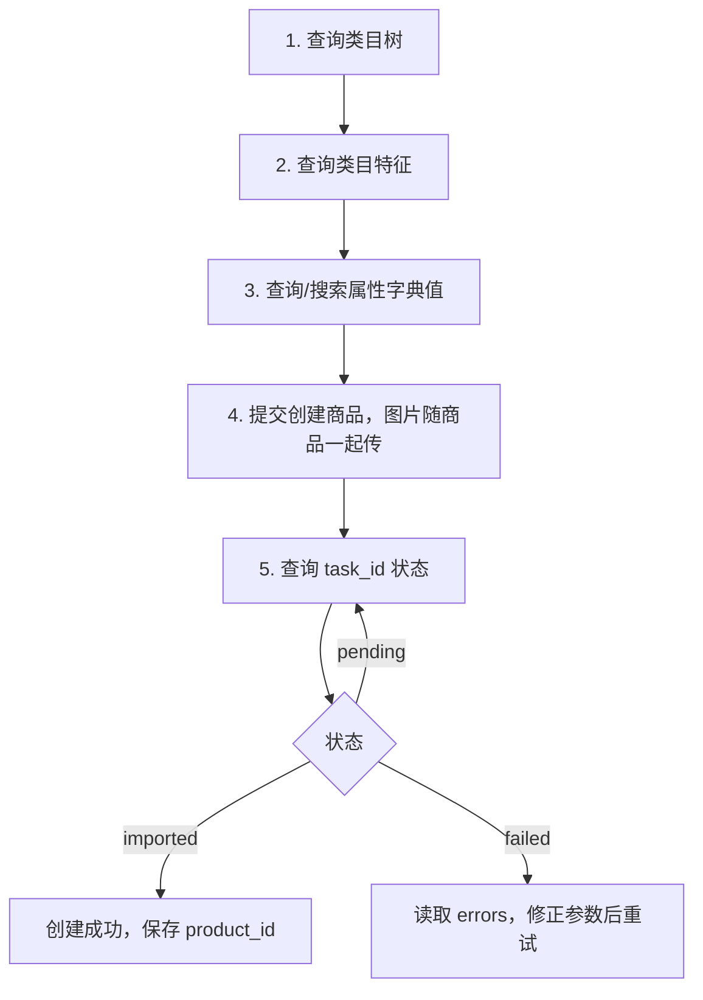
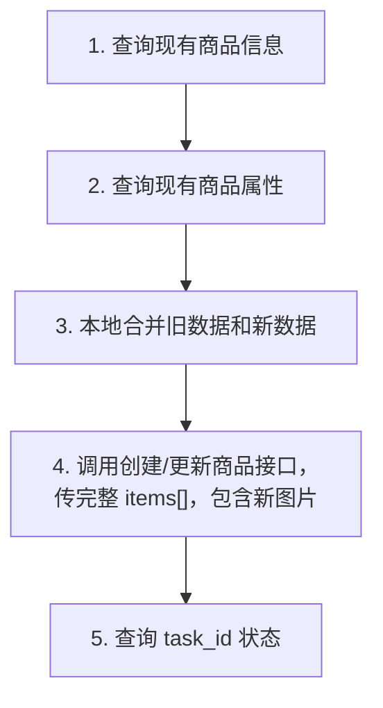
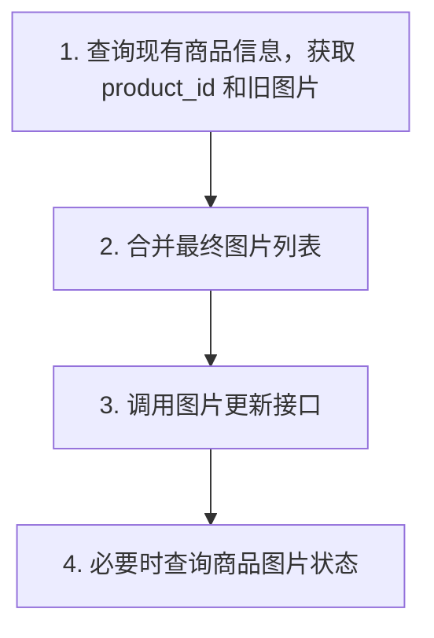

# 商品创建、更新与图片修改调用手册

本文档说明通过本地 FastAPI 服务进行以下三类操作时，需要调用哪些接口，以及每个接口的请求地址、请求头、请求参数、响应参数、请求示例、响应示例和调用逻辑。

本地服务地址示例：

```text
http://127.0.0.1:8000
```

## 公共请求头

所有本地接口都需要调用方传入 Ozon 凭证：

| 请求头 | 必填 | 示例 | 说明 |
| --- | --- | --- | --- |
| `Client-Id` | 是 | `123456` | Ozon 用户识别号。本服务会入库用于数据隔离。 |
| `Api-Key` | 是 | `xxxxx` | Ozon API 密钥。本服务不会明文入库。 |
| `Content-Type` | 是 | `application/json` | JSON 请求体。 |

## 场景一：创建商品，包含图片上传

### 调用逻辑



创建商品时，图片不需要单独先上传。只要图片是公共可访问的 JPG/PNG URL，直接放在 `POST /api/ozon/products/import` 的 `items[].images`、`primary_image`、`images360`、`color_image` 中即可。

### 1. 查询类目树

背后 Ozon 接口：`POST /v1/description-category/tree`

#### 请求地址

```http
POST /api/ozon/categories/tree
```

#### 请求参数

| 参数 | 类型 | 必填 | 说明 |
| --- | --- | --- | --- |
| `language` | string | 否 | 响应语言，默认 `DEFAULT`，即使用俄语；可选 `RU`、`EN`、`TR`、`ZH_HANS`。 |

#### 响应参数

| 参数 | 类型 | 说明 |
| --- | --- | --- |
| `result[].description_category_id` | integer | 类目 ID，创建商品时填入 `description_category_id`。 |
| `result[].type_id` | integer | 商品类型 ID，创建商品时填入 `type_id`。 |
| `result[].disabled` | boolean | 为 `true` 时不可在该类目/类型下创建商品。 |
| `result[].children` | array | 子类目/类型树。 |

#### 请求示例

```json
{
  "language": "DEFAULT"
}
```

#### 响应示例

```json
{
  "result": [
    {
      "description_category_id": 17028922,
      "category_name": "电子产品",
      "disabled": false,
      "children": [
        {
          "type_id": 91565,
          "type_name": "手机配件",
          "disabled": false,
          "children": []
        }
      ]
    }
  ]
}
```

### 2. 查询类目特征

背后 Ozon 接口：`POST /v1/description-category/attribute`

#### 请求地址

```http
POST /api/ozon/categories/attributes
```

#### 请求参数

| 参数 | 类型 | 必填 | 说明 |
| --- | --- | --- | --- |
| `description_category_id` | integer | 是 | 类目 ID，来自类目树。 |
| `type_id` | integer | 是 | 商品类型 ID，来自类目树。 |
| `language` | string | 否 | 响应语言，默认 `DEFAULT`，即使用俄语；可选 `RU`、`EN`、`TR`、`ZH_HANS`。 |

#### 响应参数

| 参数 | 类型 | 说明 |
| --- | --- | --- |
| `result[].id` | integer | 属性 ID，创建商品时填入 `attributes[].id`。 |
| `result[].name` | string | 属性名称。 |
| `result[].is_required` | boolean | 是否必填。创建商品必须填写必填属性。 |
| `result[].dictionary_id` | integer | 大于 0 表示该属性有字典值，需要继续查属性值。 |
| `result[].type` | string | 属性类型。 |
| `result[].max_value_count` | integer | 最大值数量。 |
| `result[].attribute_complex_id` | integer | 复合属性 ID。 |

#### 请求示例

```json
{
  "description_category_id": 17028922,
  "type_id": 91565,
  "language": "DEFAULT"
}
```

#### 响应示例

```json
{
  "result": [
    {
      "id": 85,
      "name": "品牌",
      "is_required": true,
      "dictionary_id": 1,
      "type": "String",
      "max_value_count": 1
    },
    {
      "id": 9048,
      "name": "型号",
      "is_required": true,
      "dictionary_id": 0,
      "type": "String",
      "max_value_count": 1
    }
  ]
}
```

### 3. 查询或搜索属性字典值

背后 Ozon 接口：

- `POST /v1/description-category/attribute/values`
- `POST /v1/description-category/attribute/values/search`

如果类目特征中的 `dictionary_id > 0`，需要用这两个接口获取 `dictionary_value_id`。

#### 请求地址：分页查询

```http
POST /api/ozon/categories/attribute-values
```

#### 请求参数

| 参数 | 类型 | 必填 | 说明 |
| --- | --- | --- | --- |
| `description_category_id` | integer | 是 | 类目 ID。 |
| `type_id` | integer | 是 | 商品类型 ID。 |
| `attribute_id` | integer | 是 | 属性 ID。 |
| `limit` | integer | 是 | 返回数量，1 到 2000。 |
| `last_value_id` | integer | 否 | 分页起点，首次传 0。 |
| `language` | string | 否 | 响应语言。 |

#### 请求示例

```json
{
  "description_category_id": 17028922,
  "type_id": 91565,
  "attribute_id": 85,
  "limit": 2000,
  "last_value_id": 0,
  "language": "DEFAULT"
}
```

#### 请求地址：关键词搜索

```http
POST /api/ozon/categories/attribute-values/search
```

#### 请求参数

| 参数 | 类型 | 必填 | 说明 |
| --- | --- | --- | --- |
| `description_category_id` | integer | 是 | 类目 ID。 |
| `type_id` | integer | 是 | 商品类型 ID。 |
| `attribute_id` | integer | 是 | 属性 ID。 |
| `value` | string | 是 | 搜索关键词，至少 2 个字符。 |
| `limit` | integer | 是 | 返回数量，1 到 100。 |

#### 请求示例

```json
{
  "description_category_id": 17028922,
  "type_id": 91565,
  "attribute_id": 85,
  "value": "Samsung",
  "limit": 100
}
```

#### 响应参数

| 参数 | 类型 | 说明 |
| --- | --- | --- |
| `result[].id` | integer | 属性值 ID，创建商品时填入 `dictionary_value_id`。 |
| `result[].value` | string | 属性展示值，创建商品时填入 `value`。 |
| `result[].info` | string | 附加说明。 |
| `has_next` | boolean | 仅分页查询时返回，表示是否还有下一页。 |

#### 响应示例

```json
{
  "result": [
    {
      "id": 5060050,
      "value": "Samsung",
      "info": "",
      "picture": ""
    }
  ]
}
```

### 4. 提交创建商品

背后 Ozon 接口：

- `POST /v4/product/info/limit`
- `POST /v3/product/import`

本地服务会先查额度，再提交商品创建，并保存 `task_id`。

#### 请求地址

```http
POST /api/ozon/products/import
```

#### 请求参数

| 参数 | 类型 | 必填 | 说明 |
| --- | --- | --- | --- |
| `items` | array | 是 | 商品数组，最多 100 个。 |
| `items[].offer_id` | string | 是 | 卖家系统商品货号，最多 50 字符。 |
| `items[].name` | string | 是 | 商品名称，最多 500 字符。 |
| `items[].description_category_id` | integer | 是 | 类目 ID。 |
| `items[].type_id` | integer | 是 | 商品类型 ID。 |
| `items[].attributes` | array | 是 | 商品属性。必填属性必须传。 |
| `items[].attributes[].id` | integer | 是 | 属性 ID。 |
| `items[].attributes[].complex_id` | integer | 否 | 普通属性填 0。 |
| `items[].attributes[].values` | array | 是 | 属性值数组。 |
| `items[].attributes[].values[].dictionary_value_id` | integer | 否 | 字典属性值 ID；非字典属性填 0。 |
| `items[].attributes[].values[].value` | string | 是 | 属性值。 |
| `items[].images` | array | 是 | 普通商品图片 URL，公共可访问 JPG/PNG，最多 15 张。 |
| `items[].primary_image` | string | 否 | 主图 URL。不传时 `images[0]` 为主图。 |
| `items[].images360` | array | 否 | 360 图片 URL，最多 70 张。 |
| `items[].color_image` | string | 否 | 营销色彩图 URL。 |
| `items[].price` | string | 是 | 当前售价，字符串。 |
| `items[].old_price` | string | 否 | 划线价，字符串。 |
| `items[].currency_code` | string | 建议 | 币种，例如 `RUB`、`CNY`。 |
| `items[].vat` | string | 是 | 增值税税率，例如 `0.1`。 |
| `items[].depth` | integer | 是 | 包装深度/厚度，不要传 0。 |
| `items[].width` | integer | 是 | 包装宽度，不要传 0。 |
| `items[].height` | integer | 是 | 包装高度，不要传 0。 |
| `items[].dimension_unit` | string | 是 | 尺寸单位：`mm`、`cm`、`in`。 |
| `items[].weight` | integer | 是 | 含包装重量，不要传 0。 |
| `items[].weight_unit` | string | 是 | 重量单位：`g`、`kg`、`lb`。 |

#### 响应参数

| 参数 | 类型 | 说明 |
| --- | --- | --- |
| `limit` | object | Ozon 额度接口原始响应。 |
| `import_result` | object | Ozon 创建/更新接口原始响应。 |
| `task_id` | integer | Ozon 异步任务 ID。 |
| `credential_ref_saved` | boolean | 是否已将 Api-Key 短期写入 Redis，用于后续轮询。 |

#### 请求示例

```json
{
  "items": [
    {
      "offer_id": "LOCAL-SKU-001",
      "name": "一套X3NFC保护膜",
      "description_category_id": 17028922,
      "type_id": 91565,
      "barcode": "112772873170",
      "currency_code": "RUB",
      "price": "1000",
      "old_price": "1100",
      "vat": "0.1",
      "depth": 10,
      "width": 150,
      "height": 250,
      "dimension_unit": "mm",
      "weight": 100,
      "weight_unit": "g",
      "images": [
        "https://example.com/image-1.jpg",
        "https://example.com/image-2.jpg"
      ],
      "primary_image": "https://example.com/image-1.jpg",
      "images360": [],
      "color_image": "",
      "attributes": [
        {
          "complex_id": 0,
          "id": 85,
          "values": [
            {
              "dictionary_value_id": 5060050,
              "value": "Samsung"
            }
          ]
        },
        {
          "complex_id": 0,
          "id": 9048,
          "values": [
            {
              "dictionary_value_id": 0,
              "value": "X3NFC"
            }
          ]
        }
      ],
      "complex_attributes": []
    }
  ]
}
```

#### 响应示例

```json
{
  "limit": {
    "daily_create": {
      "limit": 1000,
      "usage": 10,
      "reset_at": "2026-05-09T00:00:00Z"
    },
    "daily_update": {
      "limit": 2000,
      "usage": 30,
      "reset_at": "2026-05-09T00:00:00Z"
    },
    "total": {
      "limit": 100000,
      "usage": 500
    }
  },
  "import_result": {
    "result": {
      "task_id": 172549793
    }
  },
  "task_id": 172549793,
  "credential_ref_saved": true
}
```

### 5. 查询创建任务状态

背后 Ozon 接口：`POST /v1/product/import/info`

#### 请求地址

```http
GET /api/ozon/products/import-tasks/{task_id}
```

#### 请求参数

| 参数 | 位置 | 类型 | 必填 | 说明 |
| --- | --- | --- | --- | --- |
| `task_id` | path | integer | 是 | 创建商品接口返回的任务 ID。 |

#### 响应参数

| 参数 | 类型 | 说明 |
| --- | --- | --- |
| `task_id` | integer | 任务 ID。 |
| `status` | string | 任务状态：`pending`、`imported`、`failed`、`skipped`、`partial`。 |
| `data.result.items[].offer_id` | string | 商品货号。 |
| `data.result.items[].product_id` | integer | 创建成功后的 Ozon product_id。 |
| `data.result.items[].status` | string | 单个商品状态。 |
| `data.result.items[].errors` | array | 错误详情。 |

#### 请求示例

```http
GET /api/ozon/products/import-tasks/172549793
```

#### 响应示例

```json
{
  "task_id": 172549793,
  "status": "imported",
  "data": {
    "result": {
      "items": [
        {
          "offer_id": "LOCAL-SKU-001",
          "product_id": 137285792,
          "status": "imported",
          "errors": []
        }
      ],
      "total": 1
    }
  }
}
```

## 场景二：更新商品，包含图片修改

### 调用逻辑



更新商品建议仍然使用 `POST /api/ozon/products/import`，但必须传完整商品资料，包括原有且需要保留的图片、属性、尺寸、价格等。不要只传要修改的字段。

### 1. 查询现有商品信息

背后 Ozon 接口：`POST /v3/product/info/list`

#### 请求地址

```http
POST /api/ozon/products/info/list
```

#### 请求参数

| 参数 | 类型 | 必填 | 说明 |
| --- | --- | --- | --- |
| `offer_id` | array | 否 | 按卖家货号查询。 |
| `product_id` | array | 否 | 按 Ozon product_id 查询。 |
| `sku` | array | 否 | 按 Ozon SKU 查询。 |

至少传一种标识。

#### 响应参数

| 参数 | 类型 | 说明 |
| --- | --- | --- |
| `items[].id` | integer | Ozon product_id。 |
| `items[].offer_id` | string | 商品货号。 |
| `items[].description_category_id` | integer | 类目 ID。 |
| `items[].type_id` | integer | 类型 ID。 |
| `items[].images` | array | 现有普通图片。 |
| `items[].primary_image` | array/string | 现有主图。 |
| `items[].images360` | array | 现有 360 图片。 |
| `items[].price` | string | 当前价格。 |
| `items[].old_price` | string | 划线价。 |
| `items[].statuses` | object | 商品状态。 |

#### 请求示例

```json
{
  "offer_id": ["LOCAL-SKU-001"]
}
```

#### 响应示例

```json
{
  "items": [
    {
      "id": 137285792,
      "offer_id": "LOCAL-SKU-001",
      "description_category_id": 17028922,
      "type_id": 91565,
      "name": "一套X3NFC保护膜",
      "images": ["https://example.com/old-1.jpg"],
      "primary_image": ["https://example.com/old-1.jpg"],
      "images360": [],
      "price": "1000",
      "old_price": "1100",
      "vat": "0.1"
    }
  ]
}
```

### 2. 查询现有商品属性

背后 Ozon 接口：`POST /v3/products/info/attributes`

#### 请求地址

```http
POST /api/ozon/products/info/attributes
```

#### 请求参数

| 参数 | 类型 | 必填 | 说明 |
| --- | --- | --- | --- |
| `offer_id` | string | 是 | 卖家系统商品货号。服务内部会转为 Ozon `filter.offer_id` 查询。 |

#### 响应参数

| 参数 | 类型 | 说明 |
| --- | --- | --- |
| `result[].attributes` | array | 已填写普通属性。 |
| `result[].attributes[].attribute_id` | integer | 属性 ID。 |
| `result[].attributes[].complex_id` | integer | 复合属性 ID。 |
| `result[].attributes[].values` | array | 属性值。 |
| `result[].depth` | integer | 包装深度。 |
| `result[].width` | integer | 包装宽度。 |
| `result[].height` | integer | 包装高度。 |
| `result[].weight` | integer | 包装重量。 |
| `result[].images` | array | 图片信息。 |

#### 请求示例

```json
{
  "filter": {
    "offer_id": ["LOCAL-SKU-001"]
  },
  "limit": 100,
  "last_id": ""
}
```

#### 响应示例

```json
{
  "result": [
    {
      "offer_id": "LOCAL-SKU-001",
      "description_category_id": 17028922,
      "type_id": 91565,
      "depth": 10,
      "width": 150,
      "height": 250,
      "dimension_unit": "mm",
      "weight": 100,
      "weight_unit": "g",
      "attributes": [
        {
          "attribute_id": 85,
          "complex_id": 0,
          "values": [
            {
              "dictionary_value_id": 5060050,
              "value": "Samsung"
            }
          ]
        }
      ]
    }
  ],
  "last_id": "",
  "total": "1"
}
```

### 3. 提交更新商品，包含图片修改

请求地址仍然是：

```http
POST /api/ozon/products/import
```

调用方式与“创建商品”一致，但 `items[]` 要由“现有商品数据 + 本次修改数据”合并后生成。

图片修改规则：

- 如果要替换图片，传新的完整 `images` 列表。
- 如果要保留旧图片并新增图片，先查询旧图片，再把旧图片和新图片合并后传入。
- 不要只传新增图片，否则可能导致旧图片丢失。

#### 请求示例

```json
{
  "items": [
    {
      "offer_id": "LOCAL-SKU-001",
      "name": "一套X3NFC保护膜 新版",
      "description_category_id": 17028922,
      "type_id": 91565,
      "barcode": "112772873170",
      "currency_code": "RUB",
      "price": "1050",
      "old_price": "1200",
      "vat": "0.1",
      "depth": 10,
      "width": 150,
      "height": 250,
      "dimension_unit": "mm",
      "weight": 100,
      "weight_unit": "g",
      "images": [
        "https://example.com/old-1.jpg",
        "https://example.com/new-2.jpg"
      ],
      "primary_image": "https://example.com/new-2.jpg",
      "attributes": [
        {
          "complex_id": 0,
          "id": 85,
          "values": [
            {
              "dictionary_value_id": 5060050,
              "value": "Samsung"
            }
          ]
        }
      ],
      "complex_attributes": []
    }
  ]
}
```

#### 响应示例

```json
{
  "import_result": {
    "result": {
      "task_id": 172549794
    }
  },
  "task_id": 172549794,
  "credential_ref_saved": true
}
```

然后继续调用：

```http
GET /api/ozon/products/import-tasks/172549794
```

## 场景三：仅修改商品图片

### 调用逻辑



如果只改图片，不改属性、价格、尺寸等，建议使用图片专用接口。

### 1. 查询现有商品信息

请求地址：

```http
POST /api/ozon/products/info/list
```

请求示例：

```json
{
  "offer_id": ["LOCAL-SKU-001"]
}
```

需要从响应里拿：

| 参数 | 说明 |
| --- | --- |
| `items[].id` | 即 `product_id`，图片更新接口必填。 |
| `items[].images` | 现有普通图片。 |
| `items[].images360` | 现有 360 图片。 |
| `items[].color_image` | 现有营销色彩图。 |

### 2. 上传或更新商品图片

背后 Ozon 接口：`POST /v1/product/pictures/import`

#### 请求地址

```http
POST /api/ozon/products/pictures/import
```

#### 请求参数

| 参数 | 类型 | 必填 | 说明 |
| --- | --- | --- | --- |
| `product_id` | integer | 是 | Ozon product_id。 |
| `images` | array | 否 | 最终要保留的普通图片 URL 列表。 |
| `images360` | array | 否 | 最终要保留的 360 图片 URL 列表。 |
| `color_image` | string | 否 | 营销色彩图 URL。 |

重要：这个接口不是追加图片，而是用本次传入的图片列表作为最终图片列表。

#### 响应参数

| 参数 | 类型 | 说明 |
| --- | --- | --- |
| `result.pictures[]` | array | 图片处理结果。 |
| `result.pictures[].product_id` | integer | 商品 ID。 |
| `result.pictures[].url` | string | 图片 URL。 |
| `result.pictures[].is_primary` | boolean | 是否主图。 |
| `result.pictures[].is_360` | boolean | 是否 360 图片。 |
| `result.pictures[].is_color` | boolean | 是否营销色彩图。 |
| `result.pictures[].state` | string | 图片状态。 |

#### 请求示例

```json
{
  "product_id": 137285792,
  "images": [
    "https://example.com/image-1.jpg",
    "https://example.com/image-2.jpg"
  ],
  "images360": [],
  "color_image": "https://example.com/color.jpg"
}
```

#### 响应示例

```json
{
  "result": {
    "pictures": [
      {
        "product_id": 137285792,
        "url": "https://example.com/image-1.jpg",
        "is_primary": true,
        "is_360": false,
        "is_color": false,
        "state": "imported"
      },
      {
        "product_id": 137285792,
        "url": "https://example.com/color.jpg",
        "is_primary": false,
        "is_360": false,
        "is_color": true,
        "state": "imported"
      }
    ]
  }
}
```

### 3. 查询商品图片状态

背后 Ozon 接口：`POST /v2/product/pictures/info`

当前本地服务尚未封装专用地址；如需调用，可以先使用通用转发：

#### 请求地址

```http
POST /api/ozon/proxy/v2/product/pictures/info
```

#### 请求参数

| 参数 | 类型 | 必填 | 说明 |
| --- | --- | --- | --- |
| `product_id` 或相关商品标识 | array | 是 | 以 Ozon 原接口文档为准。 |

#### 请求示例

```json
{
  "product_id": [137285792]
}
```

#### 响应示例

```json
{
  "items": [
    {
      "product_id": 137285792,
      "pictures": [
        {
          "url": "https://example.com/image-1.jpg",
          "state": "uploaded"
        }
      ],
      "errors": []
    }
  ]
}
```

## 三种场景对比

| 场景 | 推荐入口 | 是否需要传完整商品资料 | 图片处理方式 |
| --- | --- | --- | --- |
| 创建商品，包含图片 | `POST /api/ozon/products/import` | 是 | 图片放在 `items[].images` 等字段中。 |
| 更新商品，包含图片修改 | `POST /api/ozon/products/import` | 是 | 先查旧数据，合并后传完整图片列表。 |
| 仅修改商品图片 | `POST /api/ozon/products/pictures/import` | 否 | 先查旧图片，传最终要保留的完整图片列表。 |

## 关键注意事项

- 所有 Ozon 创建/更新商品操作都是异步任务，拿到 `task_id` 后必须查询任务状态。
- `Api-Key` 由调用方每次传入，本地服务不会明文入库。
- 创建或更新商品时，图片 URL 必须是公共可访问链接。
- 更新商品建议传完整商品资料，不要只传局部字段。
- 图片专用接口会替换图片列表，不是追加图片。
- 如果商品属性包含字典值，必须先通过属性值接口拿到 `dictionary_value_id`。


