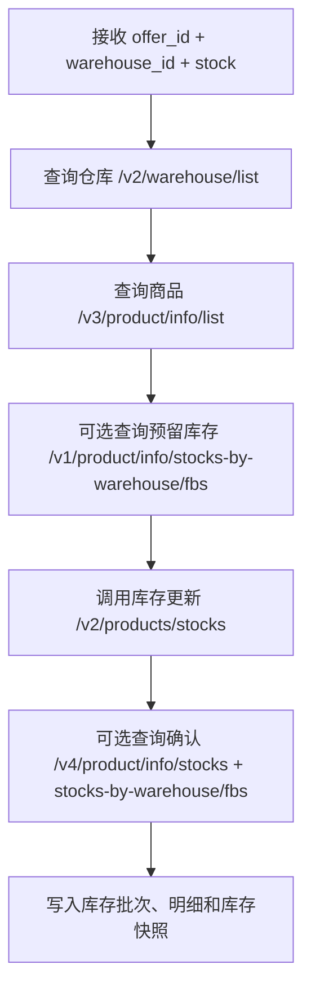

# 设置商品上架数量调用分析

本文档基于 [Prices&StocksAPI.md](../apis/Prices%26StocksAPI.md) 和 [WarehouseAPI.md](../apis/WarehouseAPI.md) 排查整理，说明如果要设置商品上架数量，也就是设置 FBS/rFBS 仓库中的可售库存，需要前置调用哪些接口，以及如何组装参数。

## 结论

新增/修改商品接口 `POST /v3/product/import` 不负责设置上架数量。商品上架数量需要单独调用库存接口：

```http
POST /v2/products/stocks
```

本地服务整合入口：

```http
POST /api/ozon/products/stocks/update
```

## 需要调用的接口

| 顺序 | 本地接口 | 背后 Ozon 接口 | 是否必调 | 作用 |
| --- | --- | --- | --- | --- |
| 1 | `POST /api/ozon/warehouses/list` | `POST /v2/warehouse/list` | 必调 | 获取可设置库存的仓库 ID。 |
| 2 | `POST /api/ozon/products/info/list` | `POST /v3/product/info/list` | 建议必调 | 校验商品存在，获取 `product_id`、`offer_id`、`sku`。 |
| 3 | `POST /api/ozon/proxy/v1/product/info/stocks-by-warehouse/fbs` | `POST /v1/product/info/stocks-by-warehouse/fbs` | 建议调用 | 更新前查询仓库维度的 `present` 和 `reserved`，避免忽略已预留库存。 |
| 4 | `POST /api/ozon/products/stocks/update` | `POST /v2/products/stocks` | 推荐 | 本地服务整合入口，自动执行前置查询、库存更新、确认和落库。 |
| 5 | `POST /api/ozon/proxy/v4/product/info/stocks` | `POST /v4/product/info/stocks` | 可选 | 更新后查询商品库存信息。 |

## 参数组装

Ozon 库存更新接口请求体：

```json
{
  "stocks": [
    {
      "offer_id": "LOCAL-SKU-001",
      "stock": 10,
      "warehouse_id": 22142605386000
    }
  ]
}
```

也可以用 `product_id`：

```json
{
  "stocks": [
    {
      "product_id": 118597312,
      "stock": 10,
      "warehouse_id": 22142605386000
    }
  ]
}
```

字段来源：

| 字段 | 来源 | 说明 |
| --- | --- | --- |
| `offer_id` | 本地商品货号或 `/v3/product/info/list` | 建议优先使用一种标识。 |
| `product_id` | `/v1/product/import/info` 或 `/v3/product/info/list` | 与 `offer_id` 二选一。 |
| `stock` | 调用方传入 | 设置的是可售库存，不包含已预留库存。 |
| `warehouse_id` | `/v2/warehouse/list` | 仓库 ID。 |

注意：如果同时传 `offer_id` 和 `product_id`，Ozon 会优先按 `offer_id` 处理。为避免歧义，建议只传一种。

## 限制和注意事项

- `/v2/products/stocks` 一次最多更新 100 个商品。
- 每分钟最多 80 次请求。
- 同一仓库商品库存每 30 秒只能更新 1 次，否则可能返回 `TOO_MANY_REQUESTS`。
- 设置的是当前可售库存，不包括已预留库存。
- 更新前建议用 `/v1/product/info/stocks-by-warehouse/fbs` 查询 `reserved`。
- 商品状态变为 `price_sent` 后才可能设置可售库存。
- 大件商品库存只能在指定库存地点更新。

## 本地服务设计

本地接口：

```http
POST /api/ozon/products/stocks/update
```

服务端执行：



需要执行表结构：

```bash
mysql --default-character-set=utf8mb4 -h 127.0.0.1 -P 3306 -u ozonservice -p < docs/ozon-api/database/stock-workflow.sql
```
