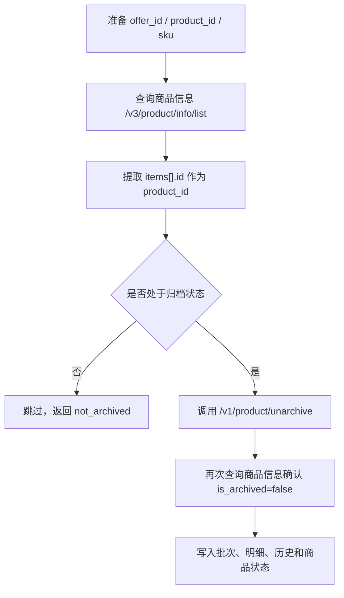

# 从归档还原商品调用分析

本文档基于 [ProductAPI.md](../apis/ProductAPI.md) 排查整理，说明如果要从归档还原商品，需要前置调用哪些接口、如何组装参数，以及本地服务如何转发整合。

## 结论

从归档还原商品最终调用 Ozon 接口：

```http
POST /v1/product/unarchive
```

该接口只接受 `product_id` 数组，不直接接受 `offer_id` 或 `sku`。因此调用方如果只有 `offer_id`、`sku` 或本地 SKU，需要先查询商品信息，把它们转换成 Ozon `product_id`。

推荐使用本地整合接口：

```http
POST /api/ozon/products/unarchive
```

## 调用流程



## 需要调用的接口

| 顺序 | 本地接口 | 背后 Ozon 接口 | 是否必调 | 作用 |
| --- | --- | --- | --- | --- |
| 1 | `POST /api/ozon/products/unarchive` | `POST /v3/product/info/list`、`POST /v1/product/unarchive`、`POST /v3/product/info/list` | 推荐 | 本地服务整合入口：自动查询商品、转换 `product_id`、过滤未归档商品、调用还原接口并确认结果。 |
| 2 | `POST /api/ozon/products/info/list` | `POST /v3/product/info/list` | 可选 | 如果调用方想自己控制流程，可先查询商品，获取 `product_id`、`is_archived`、`is_autoarchived`。 |
| 3 | `POST /api/ozon/proxy/v1/product/unarchive` | `POST /v1/product/unarchive` | 可选 | 通用转发入口。仅在调用方已经自行组装 `product_id` 时使用。 |

## 前置查询

请求地址：

```http
POST /api/ozon/products/info/list
```

请求参数：

| 参数 | 类型 | 必填 | 说明 |
| --- | --- | --- | --- |
| `offer_id` | string[] | 否 | 卖家系统商品货号。 |
| `product_id` | string[] | 否 | Ozon 商品 ID。 |
| `sku` | string[] | 否 | Ozon SKU。 |

至少传一种标识。单次请求中 `offer_id`、`product_id`、`sku` 总数不超过 1000。

关键响应字段：

| 字段 | 类型 | 说明 |
| --- | --- | --- |
| `items[].id` | integer | Ozon `product_id`，还原接口需要传入该字段。 |
| `items[].offer_id` | string | 卖家系统商品货号。 |
| `items[].sources[].sku` | integer | Ozon SKU。 |
| `items[].is_archived` | boolean | 是否手动归档。 |
| `items[].is_autoarchived` | boolean | 是否自动归档。 |

## 参数组装

从前置查询响应中取：

```text
items[].id -> product_id[]
```

示例查询结果：

```json
{
  "items": [
    {
      "id": 137285792,
      "offer_id": "LOCAL-SKU-001",
      "is_archived": true,
      "is_autoarchived": false
    },
    {
      "id": 137285793,
      "offer_id": "LOCAL-SKU-002",
      "is_archived": false,
      "is_autoarchived": false
    }
  ]
}
```

应组装为：

```json
{
  "product_id": [137285792]
}
```

其中 `LOCAL-SKU-002` 未归档，建议跳过并返回 `not_archived`。

## 调用还原接口

请求地址：

```http
POST /api/ozon/proxy/v1/product/unarchive
```

背后 Ozon 接口：

```http
POST https://api-seller.ozon.ru/v1/product/unarchive
```

请求参数：

| 参数 | 类型 | 必填 | 说明 |
| --- | --- | --- | --- |
| `product_id` | integer[] | 是 | Ozon 商品 ID 数组，一次最多 100 个。 |

请求示例：

```json
{
  "product_id": [137285792, 137285793]
}
```

响应示例：

```json
{
  "result": true
}
```

## 还原限制

- 一次最多传 100 个 `product_id`。
- 自动归档商品每天最多恢复 10 件。
- 自动归档商品恢复限额按莫斯科时间 03:00 更新。
- 手动归档商品没有每日恢复数量限制。
- 如果自动归档商品超过恢复限额，Ozon 可能返回 `restore quota is exceeded`。

## 结果确认

还原接口返回 `result=true` 表示请求执行无误。建议再次调用商品信息查询接口确认：

```http
POST /api/ozon/products/info/list
```

请求体：

```json
{
  "product_id": ["137285792"]
}
```

确认响应中：

```json
{
  "is_archived": false,
  "is_autoarchived": false
}
```

## 服务和表结构设计

从归档还原商品建议使用同一套归档工作流表，不需要新建一套重复的还原表：

| 表 | 写入方式 | 作用 |
| --- | --- | --- |
| `ozon_archive_tasks` | `action_type='unarchive'` | 记录一次还原批次。 |
| `ozon_archive_task_items` | `status='success/failed/not_found/not_archived'` | 记录单商品还原结果。 |
| `ozon_product_archive_history` | `action_type='unarchive'` | 记录归档状态变化历史。 |
| `ozon_products` | 更新 `is_archived=false`、`archive_status='active'` | 保存商品当前归档状态。 |

可选执行：

```bash
mysql --default-character-set=utf8mb4 -h 127.0.0.1 -P 3306 -u ozonservice -p < docs/ozon-api/database/unarchive-workflow.sql
```
